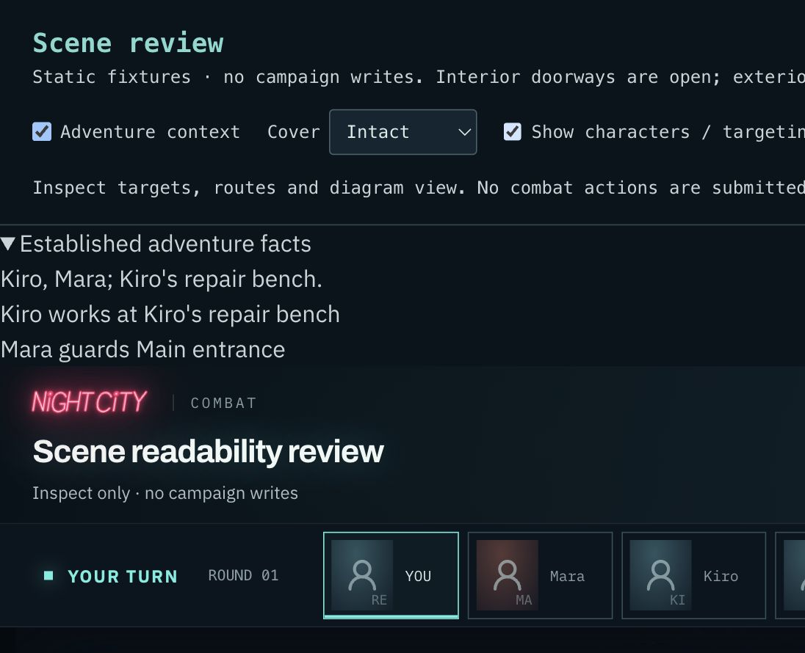

# Phase 3 — adventure context to composed encounters

Normal Job `start_encounter` actions now use the shared composer for supported
locations. The GM supplies public facts from the current beat and conversation;
it cannot supply coordinates, collision geometry, rotations or combat statistics.
Authored `Beat.scene` facts take precedence over a model proposal. Existing saved
scenes take precedence over both. The model prompt is version 2.17.0.

## What reaches the board

- Location type chooses one of the seven existing recipes. If omitted, known
  arena keys map to a recipe. Unsupported arenas such as rooftops keep their
  original authored layout; they are not relabeled as another location.
- Named enemies keep their actual keys, names and engine threat profiles. Recipe
  demonstration actors are removed. Additional named people are neutral and
  unarmed. Crowd none/sparse/busy adds zero/two/five generic tactical bystanders.
- Named important objects bind to complete existing clusters and their canonical
  cover sections. Entrances bind to actual public, service, loading or closed
  facade approaches. They do not manufacture new openings or interactive doors.
- `near`, `guards` and `works_at` constrain a named person's position relative
  to an object, entrance or person. The composer uses reachable, unoccupied tiles
  and a short legal walking path, not a distance proposed by the model. These
  relationships govern placement only, not new AI abilities or social state.
- Missing detail selects a deterministic coherent variation. Explicit facts that
  cannot fit any of three variations fail clearly; required objects are never
  silently dropped or scattered onto unrelated space.

Facts and bindings live in the immutable scene manifest. The ordinary Job route
stages the scene before initiative, then enters from the committed snapshot. The
identity includes campaign, mission, beat and the saved location key. Retries reuse
saved facts; resolved scenes cannot respawn. A later beat can establish another
scene at the same location. The narrator receives the current beat's saved facts
and completion status so it does not reinterpret the scene on a subsequent turn.

## Deployment

**Apply `supabase/migrations/20261003160000_adventure_scene_context.sql` before
shipping this client.** It adds two security-invoker RPCs with authenticated owner
checks and locked campaign/mission-progress validation. Automatic staging may not
teleport a campaign back to a stale narrator location. Entry also refuses a stale
beat. Existing authored fixture RPCs and saved encounters remain supported.

The migration ledger marks this pending until deployment is confirmed. There are
no new tables or columns. RPC types remain isolated in the backend adapter, as
with existing scene functions; deployed generated types have not been regenerated
without access to that database. An older server refuses this new route instead
of silently dropping scene facts.

## Verification

Local suite: 3,479 tests across 256 files pass; typecheck and production build pass;
code lint has zero errors and twelve existing Fast Refresh warnings. Coverage
includes all recipe families, deterministic snapshots, contextual object and
entrance binding, blocked/impossible facts, duplicate/cyclic references, rejected
model geometry, missing/corrupt saved bindings, retry reuse and no respawn.

CI generates fifteen contextual scenes from the production composer and runs the
actual staging/entry/save/completion/revisit lifecycle in disposable transactions.
It additionally rejects stale locations and beats and checks entry replay identity.
PostgreSQL is unavailable locally; migration replay in CI is the database gate.

`/scene-review` → **Adventure context** exercises the production composer with
Kiro at a named object and Mara guarding an entrance. The browser review restored
facts, named cover, geometry and positions after Save → refresh → Load. The normal
renderer and targeting UI show the resulting scene:

After deployment, run a normal Job encounter at a supported location. Confirm
that the people/objects match the preceding adventure, move and damage cover,
reload, finish combat and revisit the saved aftermath. Live model interpretation
quality and the deployed campaign round trip still need this acceptance pass.

## Boundaries

Composition currently occurs when an ordinary Job encounter starts. This does not
add automatic scene staging on every peaceful Life turn, arbitrary prose-to-map
conversion, procedural multi-floor buildings, interactive doors, new enemy goals,
or story-object interaction/loot mechanics. Final artwork remains a separate pass.
