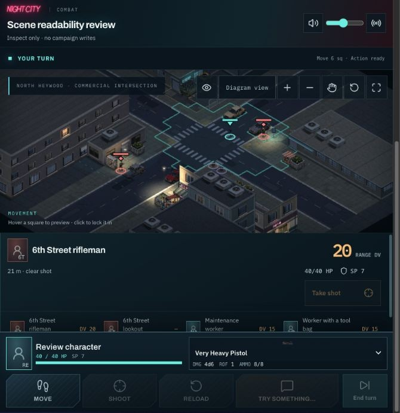
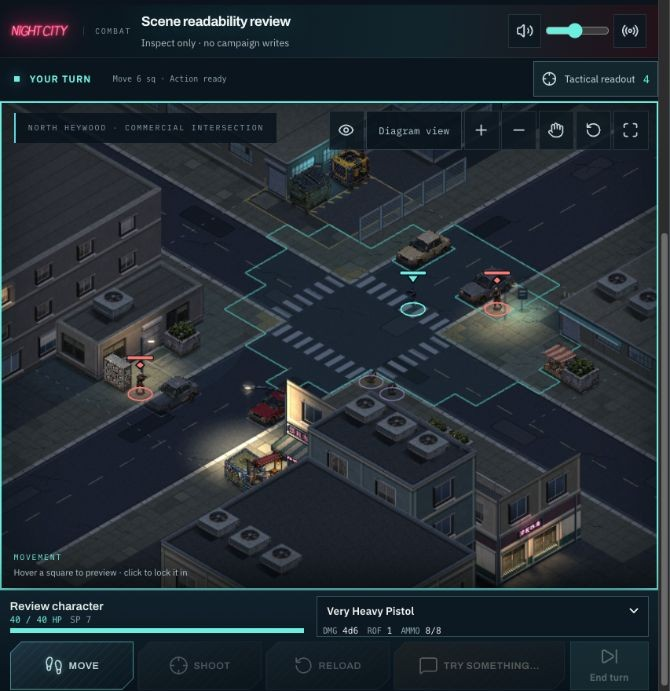
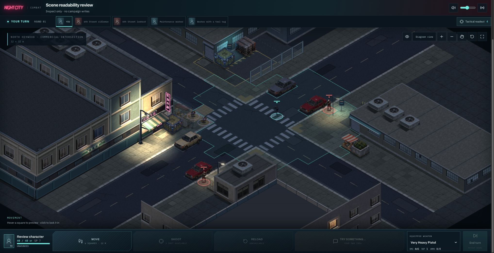
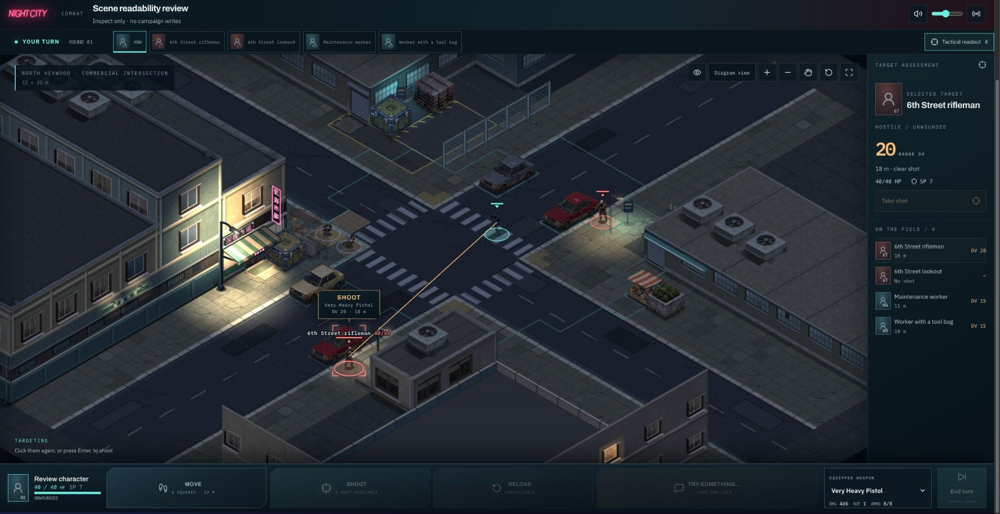
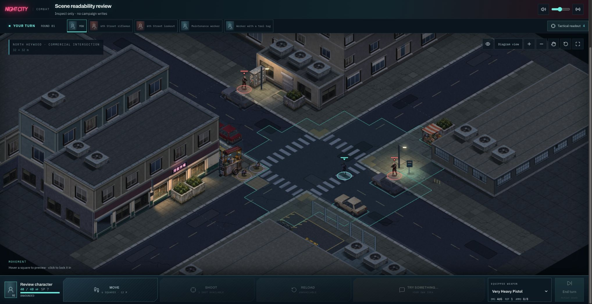
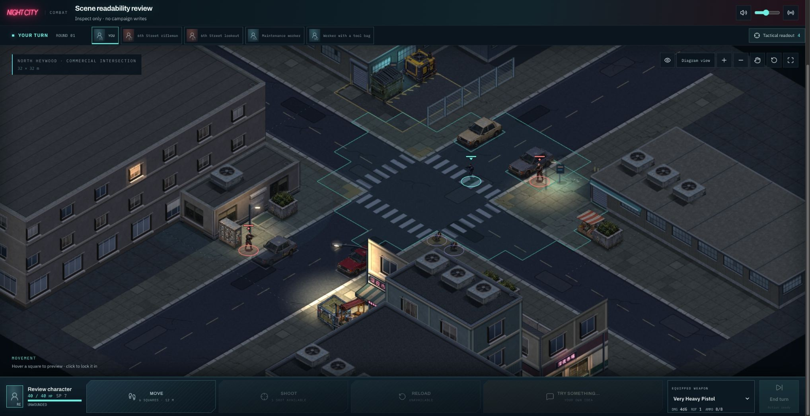
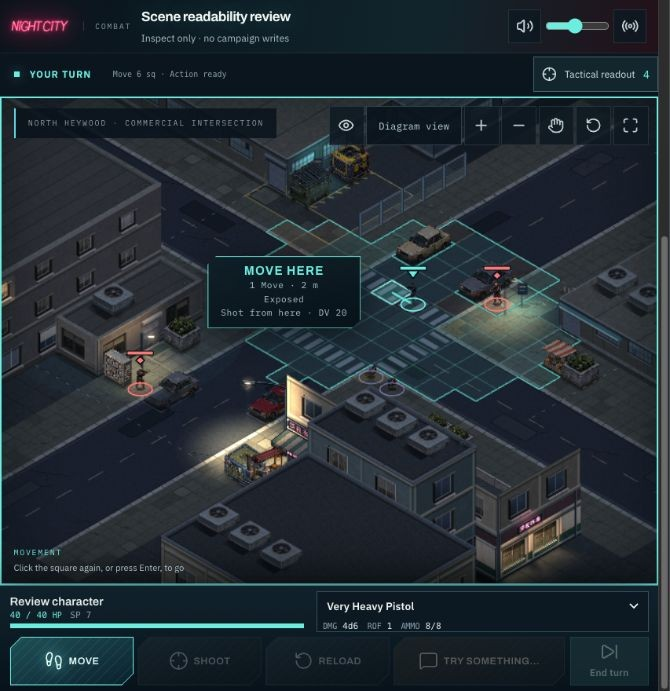
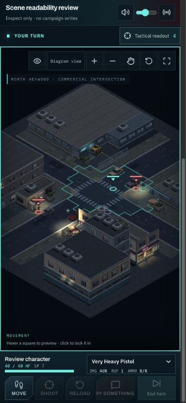

# Battlefield-first combat layout

Built on merged #311/#312, main `9655fcb1`. This is a combat layout change,
shared by all arenas; the intersection is the visual acceptance scene.

## Visible result

At a measured CSS viewport of 682 × 704, with the same seed-7 scene, camera,
lighting and reveal state, the battlefield grows from 277.75 px to 497.8 px
in height (79% more). The detailed assessment no longer occupies the screen
before the player asks for it. Desktop play gains the entire width plus space
recovered from the header, initiative strip and command dock.

| Before                                                         | After                                                        |
| -------------------------------------------------------------- | ------------------------------------------------------------ |
|  |  |

The camera preset and scene geometry are unchanged. The larger viewport makes
the existing street and actors more legible; this is not new environment art.

## Behavior

- Tactical readout toggles the existing assessment and roster, with an accessible
  expanded state and controlled region. Hidden content is removed from tab order.
- Selection and route state survive toggling. On-field previews remain available
  while the readout is collapsed.
- Pending dice and opening attack requests force the readout open. The opening
  initiative recap starts open when entering the player's first turn after a
  hostile acted; it can be collapsed after reading.
- Health, armor, weapon selection, ammunition and all action buttons remain in
  the compact dock. Desktop initiative keeps its portraits in a smaller strip.
- On compact screens the readout expands below the field; in short landscape
  windows it uses a scrollable side column. It never overlays the battlefield.
- No campaign transactions, tactical rules, saved data, renderer assets or camera
  controls changed. Existing journal, departure facts and dossiers remain accessible.

## Verification

- Bun full suite: 4,075 tests / 317 files passed. A final additional first-turn
  recap regression passes in the focused combat-board suite (22 tests).
- Typecheck, production build and lint pass (13 pre-existing lint warnings).
- Connected Chrome: seeds 7, 0 and 8 at the normal desktop viewport; compact
  682 × 704; narrow phone approximately 390 × 844; landscape 844 × 390.
- Readout open/close, roster target selection, selection retained after collapse,
  keyboard 2 m route preview and Escape cancellation checked. No live combat
  actions submitted; the scene-review harness does not submit them.
- No browser console errors in the final review. Temporary viewport override reset.

## Remaining gap

This is a substantial improvement in screen allocation, not reference parity.
Broad roofs, repeated upper facades and relatively uniform road lighting are
still visible. Very narrow portrait screens retain the existing wide camera
framing and its unused vertical space; pan/zoom controls remain available.
The next art pass should make the intersection's street-facing silhouettes and
lighting more distinctive, judged in this larger normal-play view.
