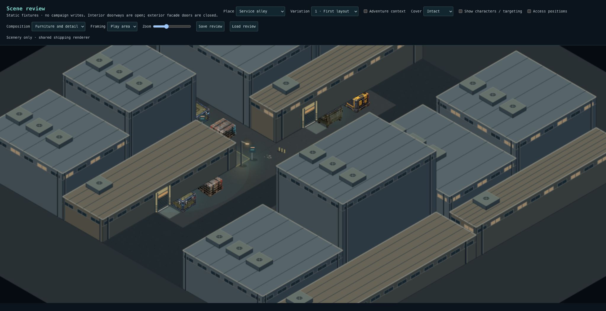
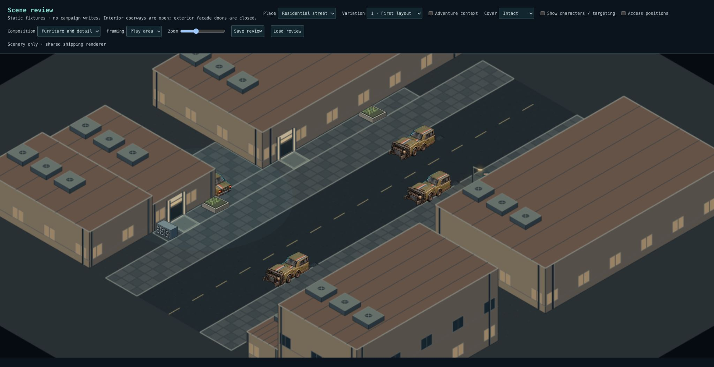

# Checkpoint 4A — service alley and residential street

Alley accepted; residential corrections ready for review. Checkpoint 3 is accepted. This release transfers the established composition machinery to two more environments; broader seed topology variation remains 4D.

## Service alley

- A reserved four-metre through passage separates circulation from the service edges.
- Two complete delivery groups and two maintenance groups replace generic service arrangements. Their working tiles are saved reservations.
- The side receiving pocket has a clear two-metre handling strip and an explicit closed receiving entrance attached to its host wall.
- All five service approaches receive facade-relative industrial surrounds. The existing stepped industrial masses and off-map passage remain.
- Generic edge infill is removed. Fewer objects express clearer activities; the old minimum-prop-count test is replaced by functional-group checks.

## Residential street

- Low attached homes contrast with a taller apartment block behind a low entrance wing, alongside the existing setback blocks and driveways.
- Nine framed doorways connect to saved entry pads: repeated unit arrivals on the three low residential groups and one shared apartment entrance. Two mailbox/planting groups identify domestic arrivals without filling the through sidewalk.
- Both sidewalks continue beyond the playable slice; their two-metre through routes are protected from furnishings.
- Two marked curbside bays hold parallel parked vehicles, with a protected four-metre centre travel lane. The optional third curbside car is removed; driveway parking remains.

The shared entrance-surround helper binds thresholds to saved facade approaches before rotation. The same snapshot reader, attachment renderer, cluster placer, pathfinding and combat engine serve both environments. Exterior doors remain closed; no walkable upper floors, new asset pack or SQL migration. Existing saved scenes retain their geometry; freshly composed scenes use recipe version 4.

## Verification

- 3,520 tests across 264 files pass; typecheck and production build pass. Code lint: zero errors, 12 existing warnings.
- New 32-seed checks per environment validate every reserved route tile, entrance reachability with intact/destroyed cover, attachment-to-entrance alignment after rotation, required functional groups and snapshot round trips.
- Exact comparison of 96 Intersection/Office/Nightclub scenes against the pre-change baseline: unchanged.
- Browser inspection: both environments furnished in variations 1–3; Structure-only view for variation 1; rotated residential access-position actors; rotated alley destroyed-cover targeting and Save/Load restoration.

## Your review

Use `/scene-review`, Service alley and Residential street, variations 1–3.

1. Structure only: industrial service passage versus domestic street should be obvious; entrances belong to buildings and the world continues beyond the frame.
2. Furnished: identify delivery/maintenance groups and the side receiving pocket in the alley; identify domestic entries, driveways and curb parking in residential.
3. Trace clear through routes and door approaches. Cargo, mailboxes, planters and cars should support those uses rather than obstruct them.
4. Enable characters and Access positions. Check occlusion/target selection, then toggle damage and Save/Load.

## Critique and limits

The provisional facade artwork still repeats strongly. Tall foreground alley masses can hide some service detail in scenery-only view; actor occlusion fading reveals the playable space during tactical review. The variants retain their existing pocket/driveway offsets and rotated arrangement; this release does not claim three new circulation topologies. More varied programs and combinations are the specific purpose of 4D.

## Residential review correction

The alley passed user review. Residential needed stronger household rhythm in Structure view and parking that reads as parked rather than stopped traffic. This correction repeats existing framed thresholds and pads along the low rows, relocates the existing domestic entry group to avoid a new threshold, and marks two saved curbside parking zones through the shared ground renderer. Road width, sidewalks, apartment massing and building footprints are unchanged; no new clutter is added.

Validation: 3,521 tests across 264 files pass, including 32-seed entrance spacing, bay adjacency and lane-clearance checks. Typecheck and production build pass; lint has zero errors and 12 existing warnings. Exact comparison of 128 alley/Intersection/Office/Nightclub scenes confirms they are unchanged. No SQL migration.

The earlier screenshots above document the original 4A release, not this correction. The cloud browser could not reach the local preview, so this correction has no fresh visual signoff. Review Residential street 1–3: with Structure view, look for multiple household entrances along each low row; furnished, confirm cars sit in the marked curb bays or driveway, leaving the centre lane and sidewalks clear. Repeat Access positions and Save/Load preservation checks before accepting residential.
