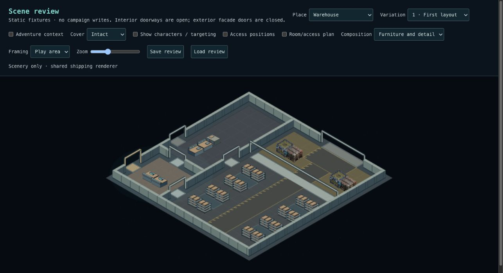
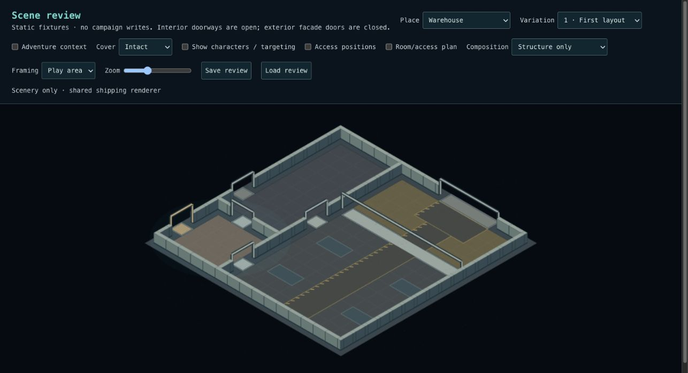
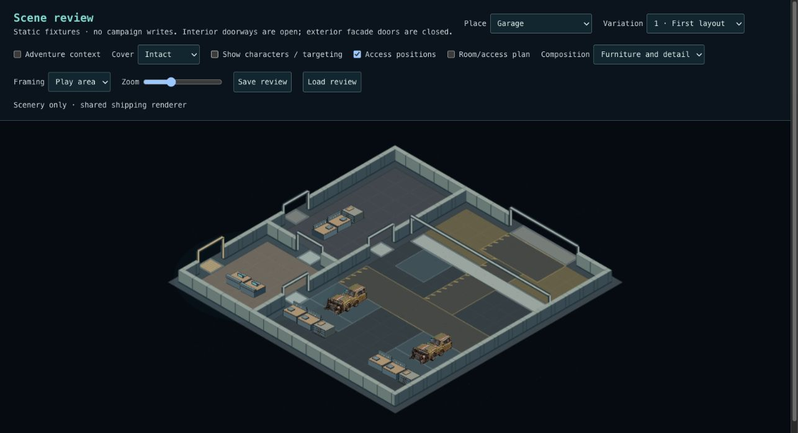
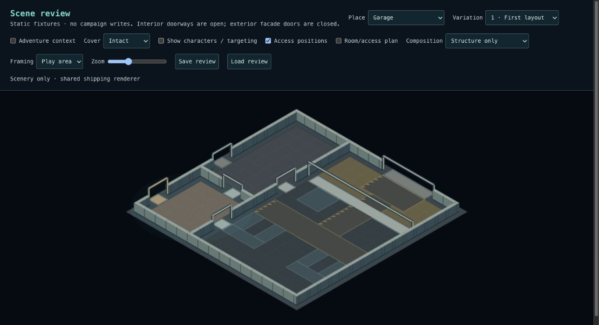
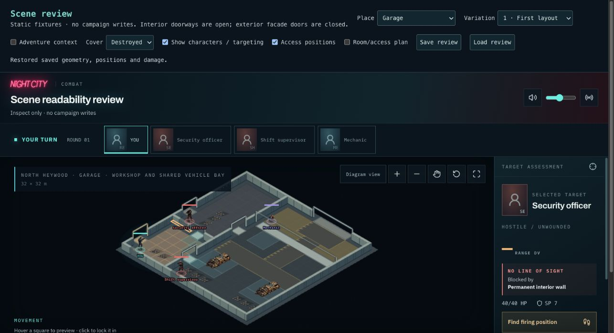
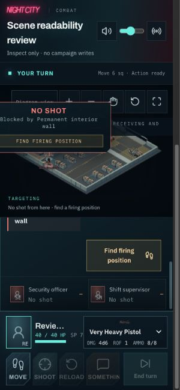

# Checkpoint 4B — warehouse and garage working arrangements

Implemented and verified; awaiting visual acceptance. Builds on merged 4A corrections. This transfer uses the existing floorplans, shared cluster solver, saved reservations and renderer.

## What changed

- Warehouse: opposed rack pairs share a picking aisle. A protected four-metre freight spine or existing cross-aisle connects the stock rooms to receiving. Stock sits beside the loading approach; marked handling space stays empty deliberately.
- Garage: two complete service bays per layout combine a vehicle, tool bench, parts cabinet and clear mechanic access at the engine and both sides. Saved vehicle approaches connect the bays to the wide exterior opening. Customer reception and maintenance remain separate.
- Both: a wall-side repair bench and parts cabinet share an accessible aisle. These functional groups replace single-object repetition rather than adding a clutter pass.
- Adventure facts recognize the new rack, repair and vehicle arrangements. Legacy cluster names and saved layouts remain readable. No SQL migration, new artwork, renderer branch, combat engine or walkable elevation.

## Review checklist

Use `/scene-review`, Warehouse and Garage, variations 1–3.

| Check                  | Pass means                                                                                                                         |
| ---------------------- | ---------------------------------------------------------------------------------------------------------------------------------- |
| Warehouse organization | Rack pairs, picking aisles and receiving stock read as related working areas.                                                      |
| Freight access         | Trace the wide loading opening through its handling apron to the stock aisles without cargo blocking it.                           |
| Garage organization    | Each car belongs to a service bay with its own tools, parts and mechanic space; it does not read as parked in a travel lane.       |
| Separate uses          | Customer arrival, maintenance and freight/vehicle movement remain understandable and distinct.                                     |
| Structure view         | Loading openings, main routes and working-floor reservations still make sense with furniture hidden.                               |
| Preservation           | Characters and targets remain readable; intact/damaged/destroyed states preserve permanent geometry; Save/Load restores placement. |

## Evidence and limits

- 3,523 tests across 265 files pass. Typecheck and production build pass. Lint: zero errors, 12 existing warnings.
- Dedicated 32-seed tests per environment cover complete groups, every reserved route tile, actor and working-access reachability intact/destroyed, deterministic composition and snapshot round trips. Existing independent car-section damage tests remain green.
- Exact comparison of 160 Intersection, Office, Nightclub, Alley and Residential scenes: unchanged.
- Browser: all three furnished variants of both environments inspected; Structure view checked for each environment's first variant; garage targeting and damage-state save/load; warehouse targeting at 390px width and destroyed-state save/load.

The garage is a repair/service garage, not a multi-storey parking structure. This release retains the three established floorplan families; broader program combinations remain 4D. Provisional shelving and car artwork is still plain, and support rooms remain comparatively quiet. Marked routes are composition reservations, not a vehicle-driving simulation.

