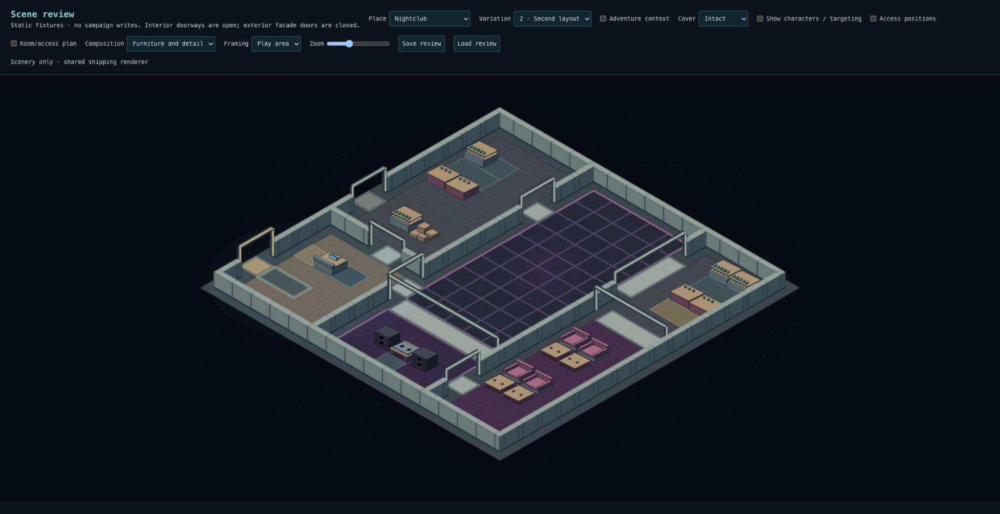
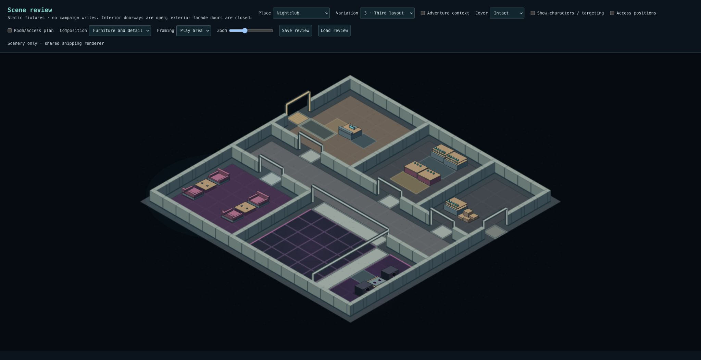
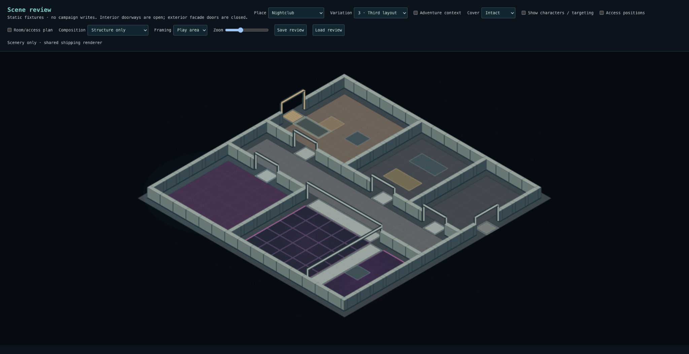
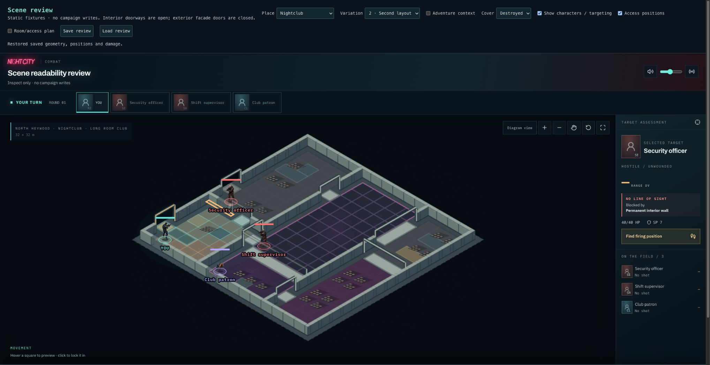

# Checkpoint 4C — nightclub arrival, performance and staff use

Accepted by Levi on 2026-10-04.

Ready for visual review. 4A is accepted; 4B remains under user review. This release closes the nightclub gaps left after the accepted bar and lounge work.

## Changes

- One admissions desk with distinct guest and door-staff positions replaces generic reception seating and perimeter infill. A saved entrance landing and foyer routes stay clear. The player starts at the primary doorway's interior approach.
- The DJ console and two flanking speakers are one required arrangement, with a protected operator position. The narrow third layout rotates the same group. Everything remains at floor level.
- Layout 1 closes the foyer-to-performance shortcut. Layout 2 replaces its foyer-to-performance opening with a direct dance-floor entrance. In all layouts, guests can reach dance, bar and seating without traversing the performance or service rooms.
- The larger service room in layout 2 receives a preparation counter and supply cabinet around a reserved staff aisle. Smaller back rooms keep the accepted stock arrangement.
- Accepted bar/lounge recipes remain. Adventure reception and performance facts recognize the new groups. No renderer or combat changes, new artwork, SQL or walkable elevation.

## Review Nightclub 1–3

| Check         | Pass means                                                                                                                        |
| ------------- | --------------------------------------------------------------------------------------------------------------------------------- |
| Arrival       | Find the primary entrance, admissions desk, guest approach and staff side immediately.                                            |
| Public routes | Trace entrance to dance floor, bar and lounge without needing to walk through the DJ setup or stock room.                         |
| Performance   | Console and speakers form a deliberate group facing the floor; the operator has usable space, including the narrow third variant. |
| Service       | Layout 2's prep counter and supplies belong to back-of-house use with working space. Compact service rooms remain uncluttered.    |
| Preservation  | Bars, lounges and dance floor retain their identities; characters, targeting, destruction and Save/Load remain usable.            |

## Verification

- 3,527 tests across 266 files pass; typecheck and production build pass. Lint: zero errors, 12 existing warnings.
- 32-seed checks block both performance and service rooms, then prove all public destinations remain reachable. Additional checks cover whole activity groups, every reserved route tile, actors and working positions intact/destroyed, determinism and snapshot round trips.
- Named adventure reception/performance bindings pass alongside existing bar/seating/freight facts.
- Exact comparison of 192 scenes across the other six environments: unchanged, including Warehouse/Garage 4B.
- Browser inspection: all three furnished layouts; Structure view for layout 3; layout 2 access-position actors, targeting/movement preview and destroyed-state Save/Load.

## Critique and limits

The admissions desk and preparation station reuse provisional furniture. Their position, working sides and room context communicate their function; dedicated artwork can strengthen that later. Admissions is a spatial arrangement, not an enforced checkpoint or queue simulation. Staff may cross public space while restocking; this does not promise an independent staff-only circulation network. Broader recipe combinations remain 4D.

