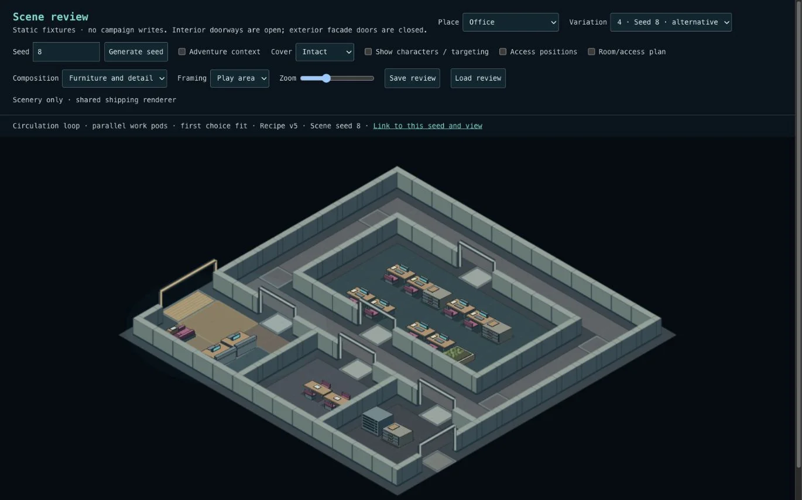
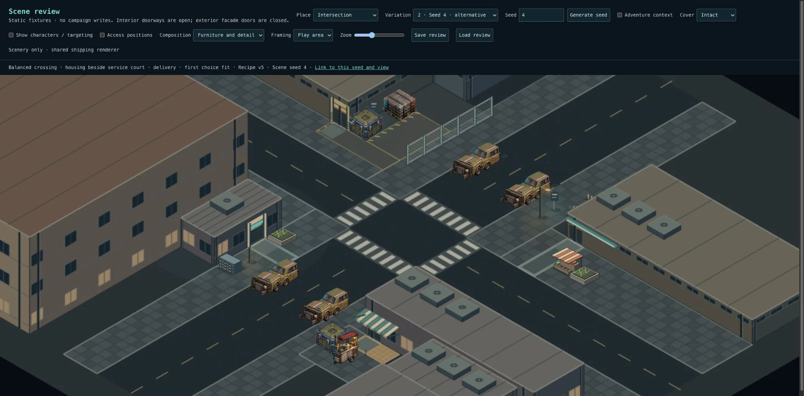

# Checkpoint 4D.1 — independent composition choices

4A–4C were accepted by Levi on 2026-10-04. This first variation release covers Intersection and Office; the other five environments remain 4D.2, with the cross-environment audit in 4D.3.

## What changes

- Named, deterministic seed streams select topology, functional program and service activity independently. Accepted seeds 1–3 retain their exact geometry as reference combinations.
- Intersection combines three street profiles with two compatible northern frontage assignments. Shop and housing exchange as whole parcels, including entrances, attachments, stock, customer space and actors. The new shop parcel uses a recessed north-facing entrance, so its canopy and forecourt remain visible to the existing camera. The southern workshop/utility parcels remain fixed, so the service court can neighbour either housing or the shop. Delivery/maintenance is a separate choice. This gives six structural combinations and twelve program combinations; height and rotation do not count toward those totals.
- Office retains the accepted central spine, circulation loop and open core. Each can use opposed work pods or parallel desk-and-filing groups, with two complete pods required. This gives six functional compositions across the three unchanged floorplans. It does not claim six new floorplans. Workstation counts remain four in spine/open-core and eight in the loop.
- Adventure facts constrain the Intersection service activity before placement. Independent seed streams no longer rely on three consecutive seeds cycling through all programs. An impossible request for both court activities fails explicitly rather than dropping a required fact.
- Shared placement still validates whole groups, door approaches, working space and connectivity. An Office parallel-pod fit failure retries once with the accepted opposed arrangement in the same topology. Only the typed placement-fit failure triggers this fallback; unexpected errors surface. The resolved program and rejection reason are saved and visible in review. Intersection uses compatible equal-width parcels and needs no stochastic retry.
- Recipe v5 saves selection provenance beside resolved geometry. Old snapshots are read as-is, without calling the composer. New generation keys/template versions identify v5. No SQL, renderer, combat, artwork or tactical-height changes.

## Review

`/scene-review` now accepts a uint32 seed, supplies six curated examples for each proof environment, and keeps the current seed/view in a shareable URL. Compare the pairs below in Structure and Furniture views. Character, access and damage switches also round-trip through the URL. A link regenerates the current recipe; **Save review / Load review** restores exact frozen geometry and damage, including an older recipe.

| Environment  | Pair   | Expected difference                                     |
| ------------ | ------ | ------------------------------------------------------- |
| Intersection | 1 / 4  | Balanced crossing, shop vs housing beside service court |
| Intersection | 2 / 12 | Shallow north blocks, alternate frontage assignment     |
| Intersection | 3 / 13 | Deep north blocks, alternate frontage assignment        |
| Office       | 1 / 4  | Central spine, opposed vs parallel pods                 |
| Office       | 2 / 8  | Circulation loop, opposed islands vs parallel pods      |
| Office       | 3 / 0  | Open core, opposed vs parallel pods                     |

Pass means the alternative feels purposeful, circulation and architectural attachments still make sense, and furnishings preserve the accepted skeleton. Inspect characters/access and damage on an alternative of each environment; save it, switch seed, and load it. Try a custom seed and reopen its link. The frozen saved-scene label distinguishes loading from regeneration.

## Evidence

- Six real pre-change snapshots are checked in as compatibility fixtures. They load unchanged, and the reference seeds retain their previous structures, zones, actors, cover and access.
- Automated seed coverage includes 0–63 plus 2147483647 and 4294967295 for each proof environment. Checks cover intact/destroyed routes, actors, work access, complete groups, attachments, determinism and exact manifest round trips.
- Diversity checks use normalized actual geometry and work furniture, ignoring IDs, labels, seeds, height and whole-scene transpose. They require six Intersection structural combinations, three Office topologies and at least six functional combinations.
- A forced incompatible pod test demonstrates deterministic fallback with two complete replacement groups and saved diagnostics. Corrupt/missing v5 provenance is rejected.
- Exact comparison of 160 scenes from Alley, Residential, Nightclub, Warehouse and Garage confirms no changes.
- Full suite: 3,536 tests across 268 files pass. Typecheck and production build pass; lint reports zero errors and 12 existing warnings.
- Browser: inspected alternative Office seeds 4/8/0 and Intersection seeds 4/12/13, including Structure view. Checked destroyed-state targeting at entrances, Save → change seed → Load, and custom seed 123456 through URL reload. Exercised Office target selection and controls at 390px; the default mobile overview remains small and relies on existing zoom controls.
- Visual review caught and corrected the initially reduced loop-office desk count and an obscured shop canopy after exchanging corners.

## Critique and limits

This is deliberately a bounded grammar. Northern Intersection parcels have matching interfaces; arbitrary parcel permutation is not supported. Office variety here is functional furnishing within approved topologies, not new architecture. Some low-level zone IDs retain their authored names after parcel exchange; their saved bounds and relationships are authoritative.

The test suite proves constraints, not perceived quality. The visual comparison remains a signoff gate. The work should not be described as arbitrary prose producing unlimited polished maps, and neither rotation nor changes in minor clutter count as new compositions.
