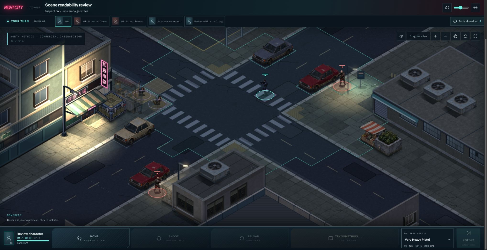
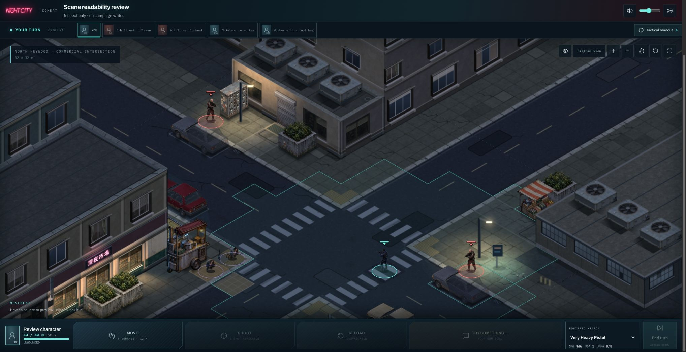
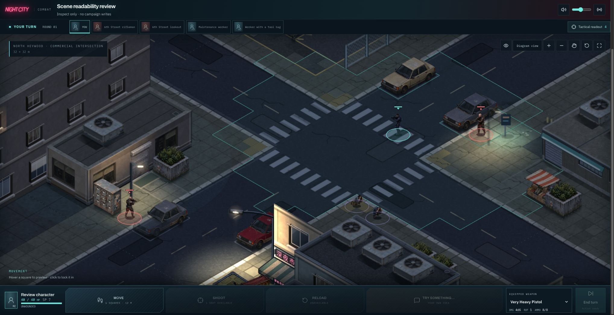
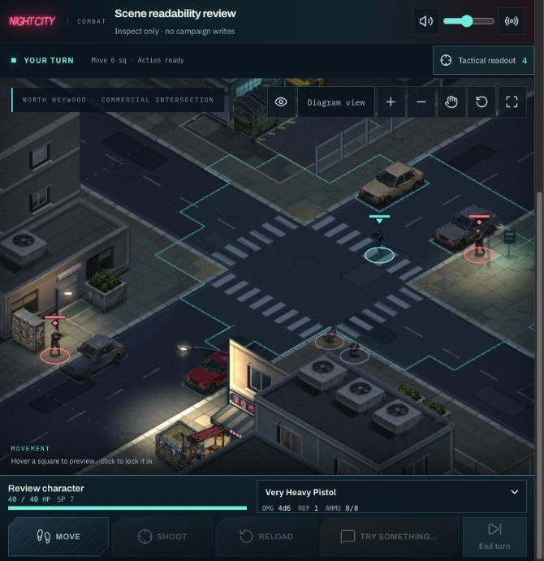
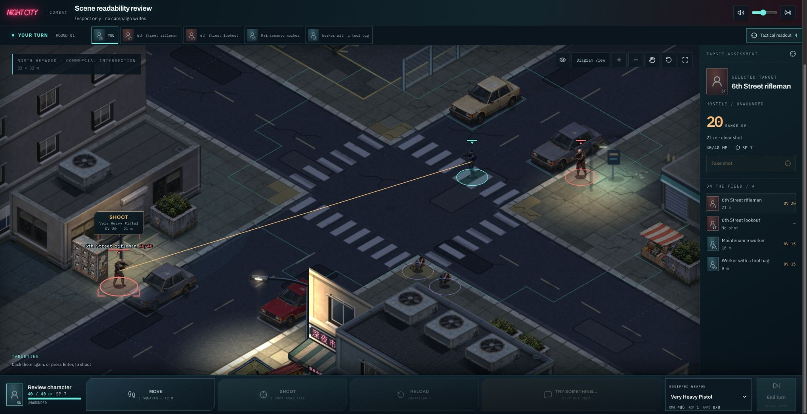
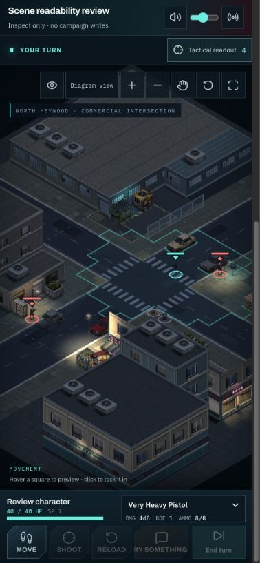

# Intersection composition prototype

First implementation stage of the agreed street-composition and lighting milestone.
Based on merged #313, main `f838ec0e`. Existing assets, geometry, lights and materials
are used to isolate the composition change.

## Result

The intersection starts framed around a snapshot of its standing participants,
including neutral characters, with a 2.5 m projected apron and space for their
heads and the camera controls. A ceiling prevents a small group from producing
an extreme close-up. Widely separated groups take precedence over that preferred
closeness: the fit backs out to include them.

At the captured desktop size, seed 8 changes from zoom 1.35 to approximately 2.02:
characters, cars and architectural detail are approximately 50% larger on screen.
This is a camera change, not a rescaling of objects or a smaller tactical map.

| Merged baseline                                               | Action composition                                           |
| ------------------------------------------------------------- | ------------------------------------------------------------ |
|  |  |

## Camera behavior

- The participant snapshot stays fixed during turns, route previews and playback.
  It is refreshed for a new encounter, or when the player presses Reset camera.
- Automatic framing adapts to the actual board size, including readout expansion.
  Panning, zooming or Overview makes the camera manual until Reset.
- When standing participants are outside the visible frame, a button reports the
  count and can frame the current participants. This avoids silently losing actors
  after panning or after they move outside the starting composition.
- The existing whole-map Overview remains available. Explicit review `cam=` values
  remain authoritative. Other environment camera presets are unchanged.
- Scenery-only review uses the same fitting algorithm and its fixture's participant
  positions, labelled Action area. It still renders no actors, so actor-dependent
  cutaways differ from the combat view. Overview continues to show the entire map.

## Verification

- Bun: 4,082 tests in 317 files pass. The first full run, concurrent with a production
  build, hit the existing 5-second warehouse variation timeout; a repeat without
  the competing build passes. No timeout or assertion was relaxed.
- Typecheck, production build, changed-file lint pass. Repository lint has its
  existing 13 warnings and no errors.
- Fit tests independently project heads and feet into desktop, compact, portrait
  and short-landscape viewports; cover four seeds, widely separated positions,
  empty/invalid inputs, unchanged non-intersection presets and nonmutation.
- Connected Chrome checked seeds 8, 0 and 7, a 682 × 704 viewport and a narrow phone.
  Pan moved all five participants offscreen; the recovery button restored the
  exact prior framing. Overview/reset, target selection with the readout expanded,
  keyboard route preview/cancel and scenery-only Action area checked.
- No final console errors. Temporary viewport override reset. No campaign actions
  submitted in the read-only scene-review fixture.

## Art direction findings and remaining work

The closer view improves the reference's street-to-building balance and character
readability. It also exposes the real next gaps: broad, uniformly dark road areas,
repeated facade/roof treatment, and similar-looking street lights. Seed 7 still
has a less favorable shop orientation; camera framing alone cannot change that.
This prototype does not complete the lighting or distinctive-frontage stages.

The existing painted window interior, cars, planters and food cart are reusable.
Replacing them now would have less payoff than improving how the scene lights and
composes them. The existing reflection pilot is explicitly unaccepted in
`groundReflection.ts` (pale stains and isolated reflected marks at play zoom);
its default remains `skip`.

Next implementation target: the wet street and lighting pass, evaluated in this
composition. Establish a coherent wet/dry ground treatment, source-shaped broken
reflections, material-dependent response and stronger contact with the pavement.
Then specify new traffic-light/advertising fixtures and a contrasting business
frontage against verified placement envelopes, with neutral base art and separate
emissive masks. Asset generation guides should follow those placements, so new
art fits saved geometry and has a proven use.
