# Checkpoint 1 closure: structure and circulation

Scope: finish the Office/intersection foundation. No new prop types, activity recipes,
art assets, combat systems, SQL or walkable upper floors. Await the owner's final visual
approval; do not begin checkpoint 2 as part of this change.

## Structural changes

- Attached shops: three low units share one street frontage, with stepped rear depths.
- Housing: a tall block and low entrance annex form a stepped footprint.
- Workshop: a low L-shaped structure leaves a street-facing 6 × 10 m handling court;
  a protected side passage continues beyond the combat boundary.
- Utility: one broad low building set behind a clear forecourt.
- Buildings, frontage and pavement extend farther beyond the 32 m playable slice.
  The shared ground canvas now covers that geometry rather than clipping at the old
  art-sheet edge. Building depth uses the nearest ground corner so extending a mass
  does not put ground props over its roof through centre-based sorting.
- Shared provisional elevations space storeys in world metres. Industrial sheds have
  one high window band instead of repeated apartment-like floors.
- Interior trim meets the cut wall ends and includes an overhead frame. The primary
  entrance has a taller warm frame and a visible protected arrival landing.
- Office 3 now has a square 12 × 12 m work core with private/support rooms to one side.
  Its previous 20 × 6 m workspace was a graph hub but still looked like a wide corridor.
  Office 1 retains a corridor spine; Office 2 retains a genuine corridor loop.

## Furnished preservation

All three variations of both scenes were inspected in the shipping renderer, first
without furniture/characters, then furnished with characters. Office frames, entry
landings, corridors and first steps remain readable. Intersection crossings and their
receiving zones remain open; actor occlusion fading and targeting remain available.
The workshop uses the existing delivery slot, without additional court infill. The
intersection edge filler budget was reduced from three to two groups per zone.

| Intersection variation | Previous cover sections | Current cover sections |
| --- | ---: | ---: |
| 1 | 28 | 23 |
| 2 | 29 | 23 |
| 3 | 23 | 21 |

These are attackable sections, not individual assets. No new furnishing recipe was
added. Existing delivery/dressing positions can change as their supporting zone moves.

Automated checks cover connected pedestrian routes and clear reservations over 32
seeds, visible unbuilt service courts, nonrectangular corner footprints, off-map service
continuation, bounded furnishing counts, office graph topology, square-core proportions,
protected arrival landings, snapshot round trips and existing placement/combat invariants.

Validation: 3,493 tests across 260 files; typecheck and production build pass. Lint has
zero errors and 12 existing warnings. No SQL migration. Existing saved layouts retain
their own geometry; newly composed layouts receive these changes. Shared presentation
improvements also apply to existing scene snapshots.

## Visual evidence

| Variation | Office structure | Intersection structure |
| --- | --- | --- |
| 1 | 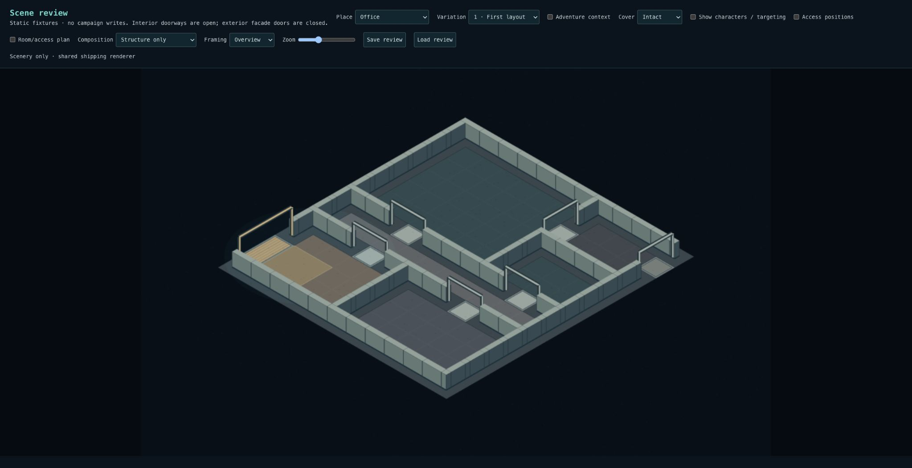 | 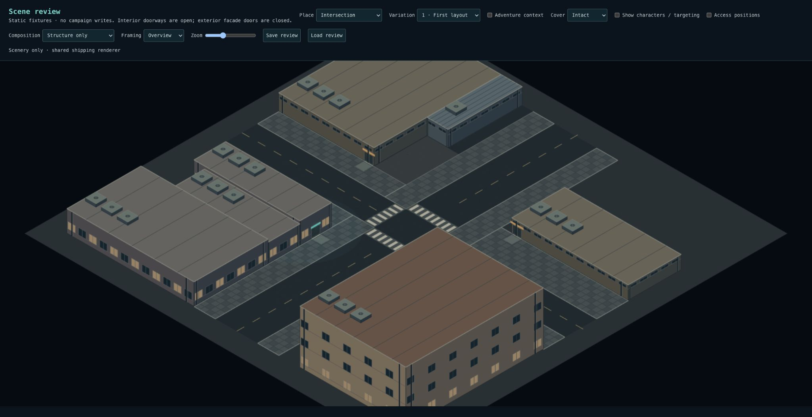 |
| 2 | 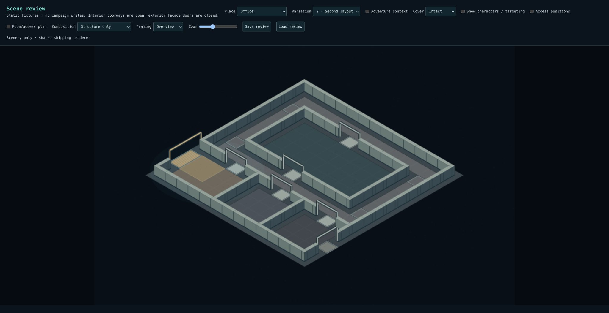 | 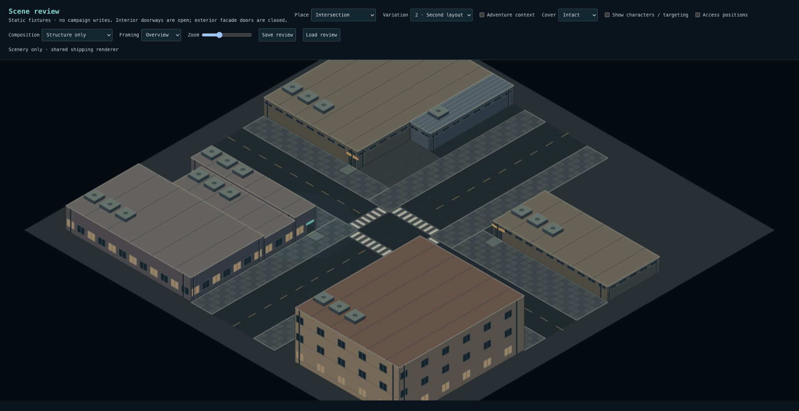 |
| 3 | 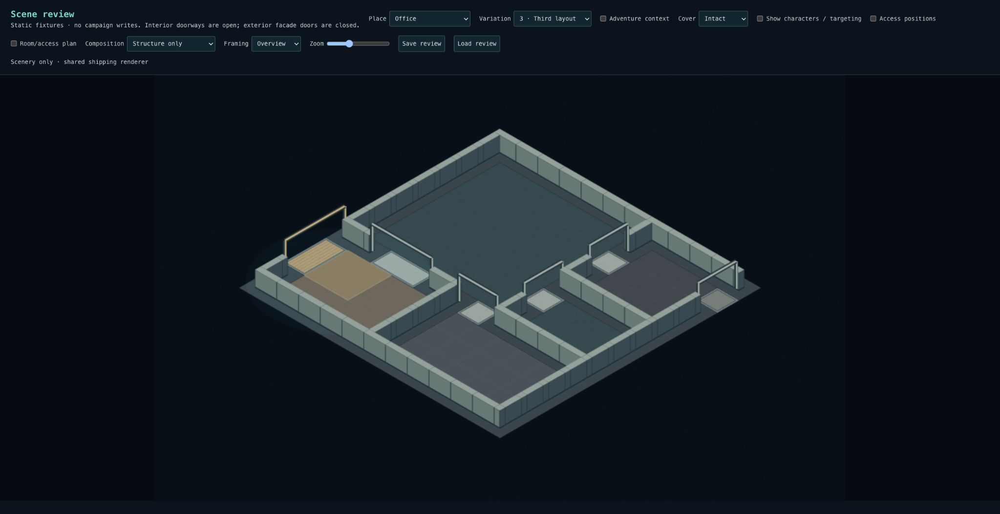 | 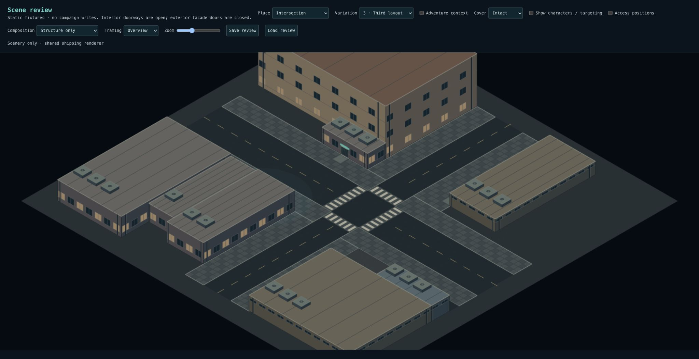 |

| Variation | Office furnished | Intersection furnished |
| --- | --- | --- |
| 1 | 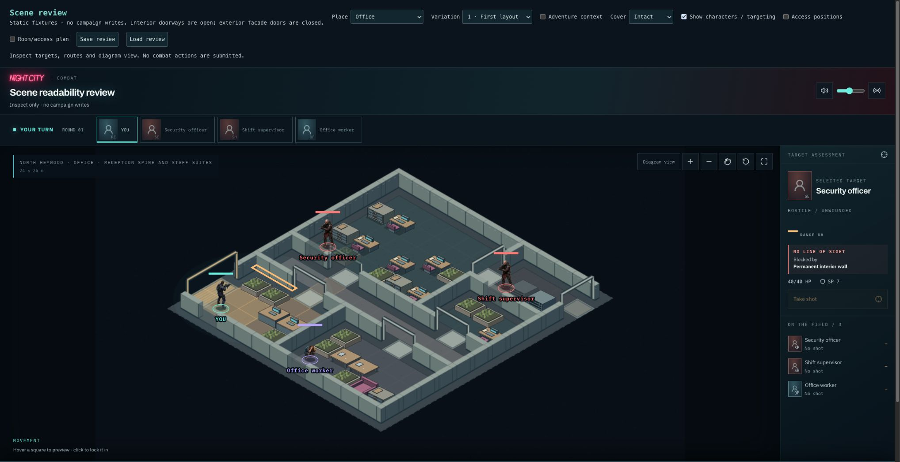 | 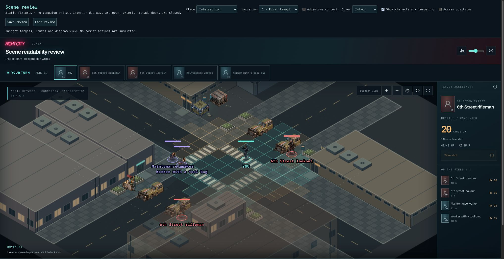 |
| 2 | 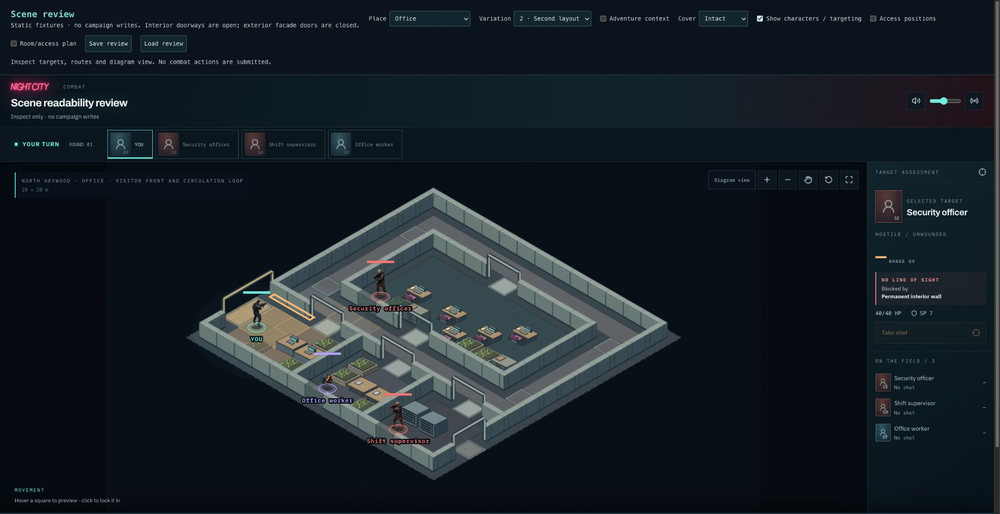 | 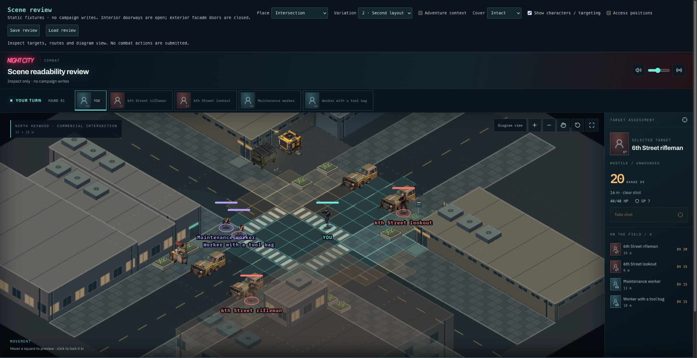 |
| 3 | 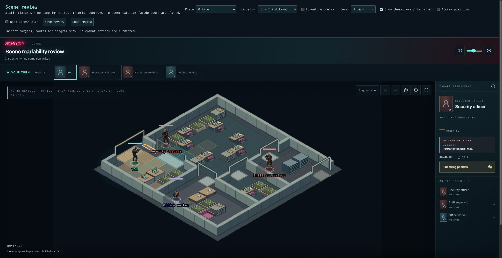 | 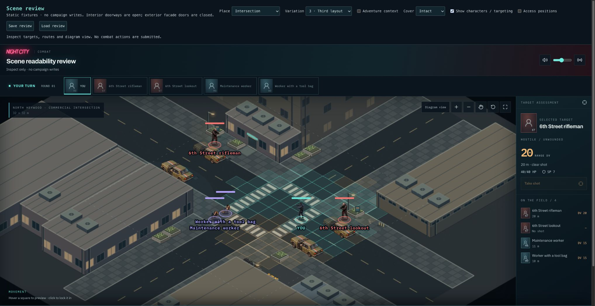 |

## Review and limits

In `/scene-review`, compare Office and Intersection 1–3 in Structure/Overview, then
Furniture/Play area with characters enabled. Identify the four corner programs and
three office organizations, trace entry-to-route connections, and verify furnishing
preserves them. Large foreground masses can hide their far-side annexes/courts in a
fixed isometric view; Overview and the rotated third fixture expose more geometry.
Character views retain the existing automatic occlusion fade.

This is a bounded authored structural vocabulary, not broad combinatorial variation.
Final facade/door artwork, richer activity groups, decorative attachments and wider
recipe variation remain later work. Exteriors have closed facade doors; interior
openings remain always open. Upper levels remain decorative.
