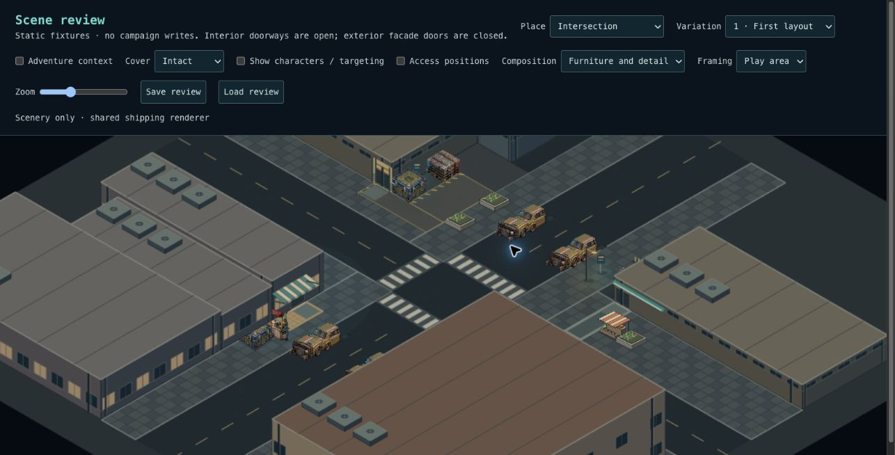
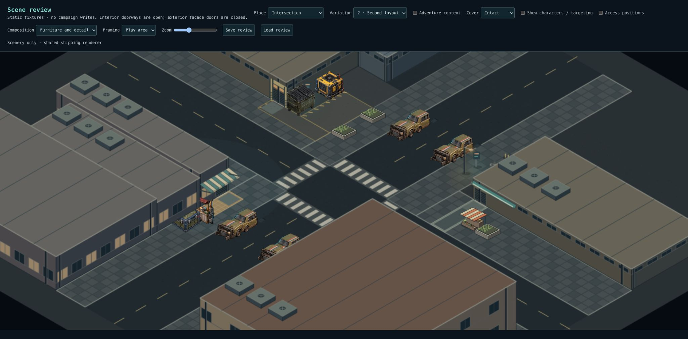
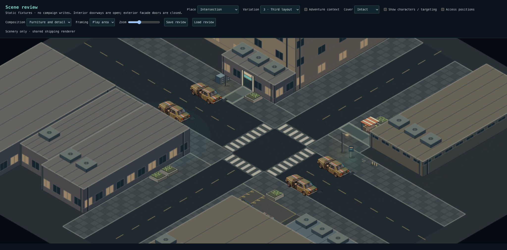

# Checkpoint 3A — attached frontages

Checkpoint 3A passed: Levi approved the visual and preservation review on 2026-10-03. Checkpoint 2 is accepted.

## Scope

Four architectural cues attach to saved Intersection building faces:

- A striped shop canopy covers the customer forecourt, staying clear of the through-sidewalk.
- A modest residential entrance surround frames the apartment threshold.
- A continuous retail header ties the low commercial frontage to its display.
- An industrial surround emphasizes the existing workshop doorway.

Attachments store their edge, offset, span, projection and height inside the parent structure. Transposing a layout transposes its attachment edges too. Snapshot validation rejects invalid sizes, off-face placement, excessive height and intersections with neighboring structures. Older layouts without attachments continue to load unchanged.

These are nonblocking facade treatments, not ground props or attackable cover. They paint into the parent building sprite and inherit its sorting and actor occlusion fading. No location-specific renderer branch, new art sheet or SQL migration is required. No Office/Nightclub redesign, prop density increase, elevated movement or lighting pass.

## Review Intersection 1–3

1. In variations 1–2, the canopy should visibly attach to the shop and shelter the warm customer pavement without covering the through-sidewalk.
2. The low shop's continuous header should connect its display to the building.
3. Variation 3 exposes the framed residential entrance; other facades correctly turn away from the fixed camera rather than drawing through the building.
4. The workshop threshold should look industrial while its approach remains open.
5. Save review, change variation, then Load review: attachments should return with the original layout.

The scenery camera still hides rear-facing entrances in some variations. The art is deliberately provisional. A frame is not an operable door, and the existing closed exterior facade remains solid.

## Validation

- 3,515 tests across 262 files pass; typecheck and production build pass.
- Lint: zero errors, 12 existing warnings.
- 32-seed snapshot/forecourt checks, all four edge transpositions, malformed-data rejection and legacy snapshot compatibility.
- 96-scene comparison against merged Checkpoint 2: Office/Nightclub unchanged; Intersection identical after removing the new visual attachment metadata. This includes all actors, cover, reservations and structures.
- Furnished Intersection 1–3 inspected; browser Save/Load restored saved geometry.

## Remaining Checkpoint 3 work

**3B:** add the service court's physical boundary and deliberate loading opening, using authoritative movement/shot geometry. Preserve the handling apron and rear access.

**3C:** review the complete treatment with furniture and actors, rotation, destruction where applicable, small-screen readability and persistence. Checkpoint 3 is not yet complete.

