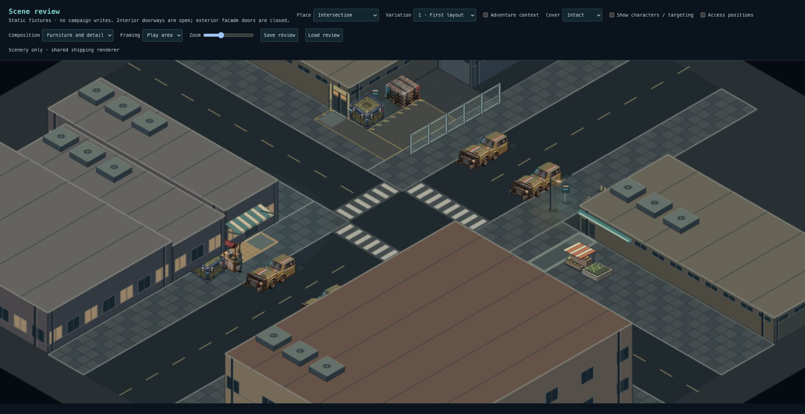
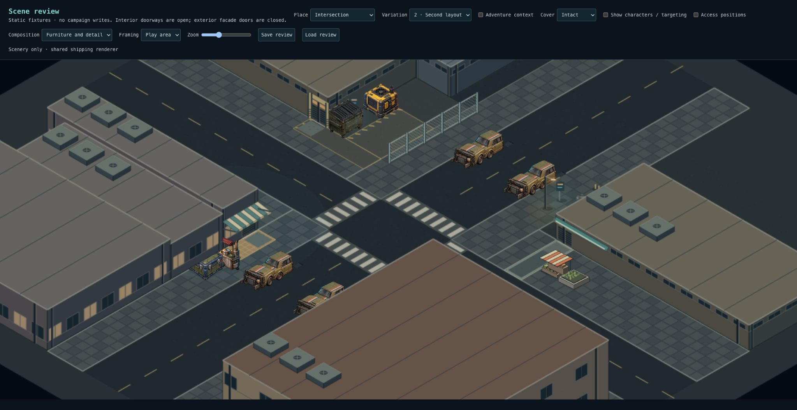
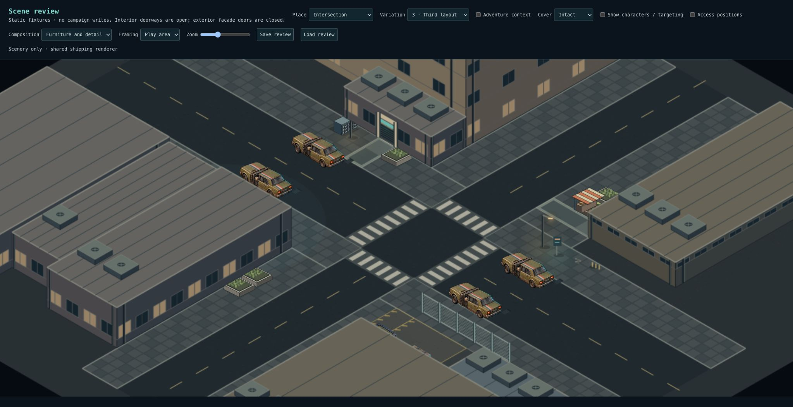

# Checkpoint 3B — service court boundary

Accepted by Levi on 2026-10-04, including character readability and preservation. See [3C](checkpoint-three-c.md) for combined tactical and small-screen verification.

## Composition

A ten-metre open-mesh fence defines the court's outer edge. It replaces the two edge planters. The workshop and rear return define the other sides; the front remains an intentionally open loading mouth with a saved six-metre clearance reservation. The two-metre rear service lane remains inside the boundary and exits through the open rear end. No gate interaction or vehicle-driving simulation is introduced.

The fence's half-metre footprint straddles grid tile centres, so its visible line corresponds to blocked movement tiles in the existing grid engine. It stays outside all protected aisles, crossings and working reservations. Mesh provides no shot obstruction or cover. This is permanent environment geometry, with no HP or destruction state; destroying nearby cargo does not remove the fence. It is not an attackable solid wall.

The shared renderer draws depth-sorted two-metre mesh sections from the saved footprint. No location-specific combat or rendering branch. Snapshot validation rejects fences that block shots, miss tile centres or overlap reserved routes. No SQL migration. Existing snapshots retain their original geometry.

## Review Intersection 1–3

- The service corner should read as an open working court with a defined outer edge.
- Find the wide front loading mouth beside the workshop door. It must remain obvious and unobstructed.
- Trace the public sidewalk outside the fence and rear service access inside it.
- The mesh should look permeable to sight and shots, not like a protective wall.
- The accepted storefronts, residential entry and furnishings remain intact. Two court-edge planters are intentionally gone.
- Save/Load preserves the fence's position and orientation.

## Validation

- 3,517 tests across 263 files pass; strengthened cross-fence ray tests also pass.
- Typecheck and production build pass; lint has zero errors and 12 existing warnings.
- 32-seed tests verify blocked fence tiles, reachable loading/handling/rear/public routes, no shot obstruction in both orientations, malformed-data rejection and saved geometry.
- 96-scene baseline comparison: Office/Nightclub unchanged; Intersection differences limited to the fence, loading-mouth reservation and removal of two edge planter groups. Accepted 3A attachments are unchanged.
- Furnished Intersection 1–3 inspected and browser Save/Load verified.

## Limits

The loading opening is always open. The boundary is not climbable, operable or destructible in this milestone. Grid movement reserves a full tactical tile along its thin visible strip, consistent with the existing tile-centre movement model. Final art and the complete character/small-screen acceptance pass remain separate work.

