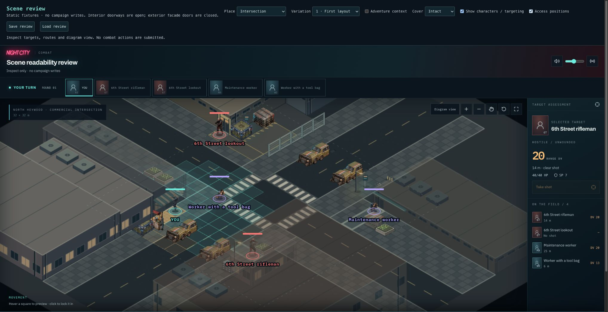
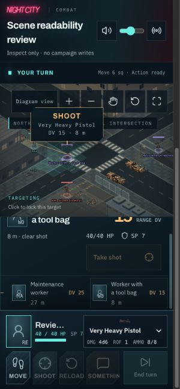

# Checkpoint 3C — combined preservation

3A and 3B are accepted by Levi. Engineering verification for 3C is complete; Checkpoint 3 is ready for final user acceptance. This release adds regression coverage and evidence, with no runtime, layout, density or SQL changes.

## Evidence

- All 3,518 tests across 263 files pass. Typecheck and production build pass. Code lint reports zero errors and 12 existing warnings.
- New 12-seed test exercises intact, half-damaged and destroyed cover. Permanent fence tiles remain blocked, every exterior entrance remains reachable, destroyed cover releases its occupied tile, and environmental geometry remains unchanged and snapshot-readable.
- Existing 32-seed fence tests verify protected routes, shot permeability in both orientations, and rejection of invalid fence geometry. Existing scene-review round trips cover all seven environments, three variations and both actor-placement modes.
- Browser: Intersection 1 with actors at entrances shows canopy/building fading and readable character markers. Intersection 2 damaged cover and diagram view preserve the fence footprint and route geometry. Intersection 3 destroyed cover restores geometry, positions and damage after saving, changing fixtures, and loading.
- At a 390 × 844 CSS viewport, the target list selects the worker, updates the assessment to 8m / DV15, and zoom remains usable. Whole-map character labels are small at fit-to-map scale; zoom and the target list remain necessary for close inspection. The temporary viewport override was reset.
- Furnished Office open-core/access-position smoke check preserves arrival, thresholds and wall-based shot obstruction. No Office or Nightclub generation/rendering code changes in this PR.

These are static review fixtures plus engine tests, not a live campaign combat or database migration replay. The harness intentionally does not submit attacks.

## Final acceptance check

In `/scene-review`, use Intersection 1–3, characters and Access positions enabled:

1. Characters remain identifiable/selectable under the canopy and behind buildings; inspect one narrow-window view with zoom.
2. Fence blocks movement but supplies no cover or shot obstruction. Loading mouth and public sidewalk remain usable.
3. Switch Intact / Damaged / Destroyed: only destructible props change; structures and attachments remain.
4. Save a destroyed-cover scene, switch fixtures, then Load: arrangement, actor positions and damage return exactly.

No additional detail or art polish is required to accept this checkpoint. Fences remain permanent, non-climbable and non-operable; facade doors remain closed and interior openings remain open.

