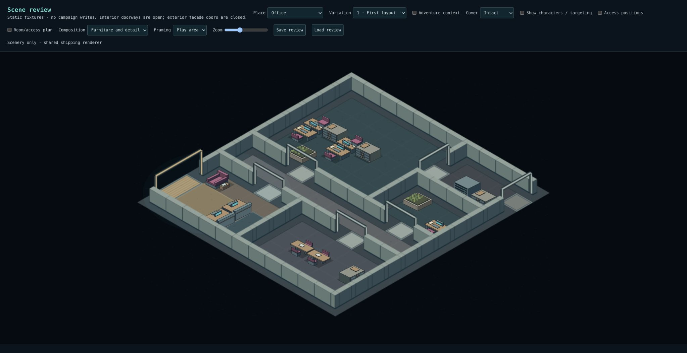
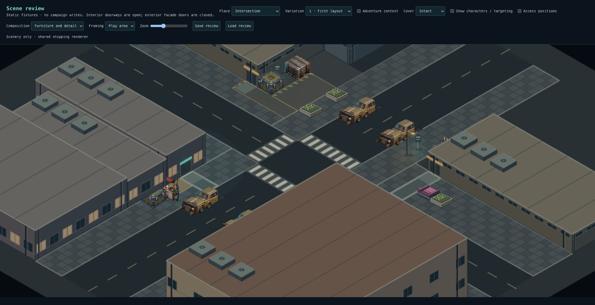
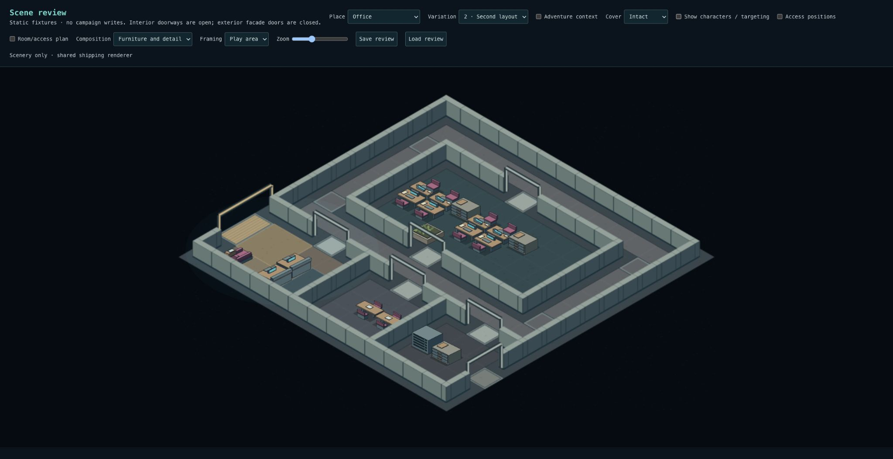
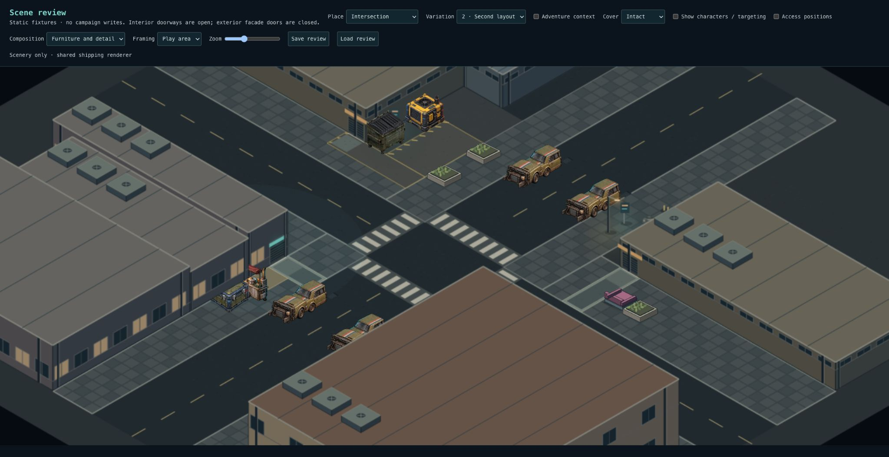
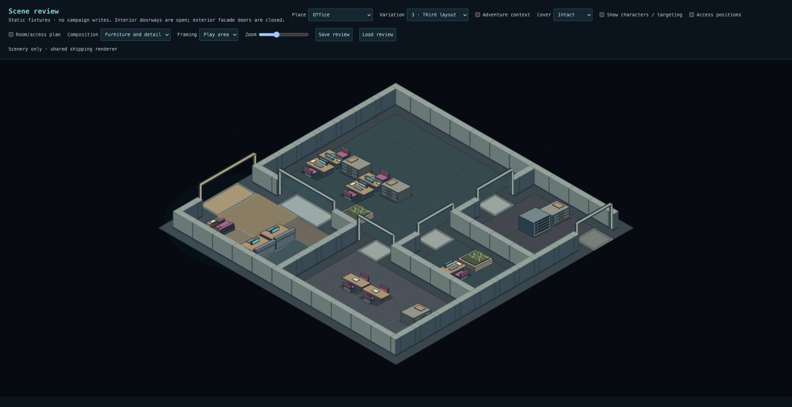
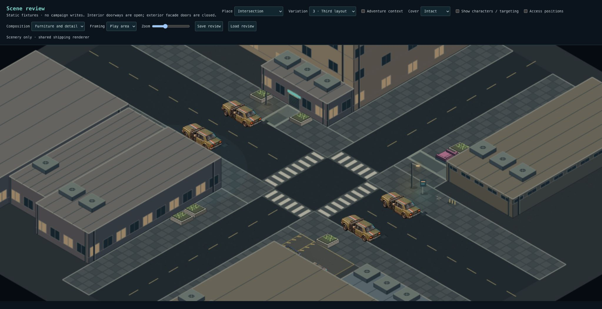
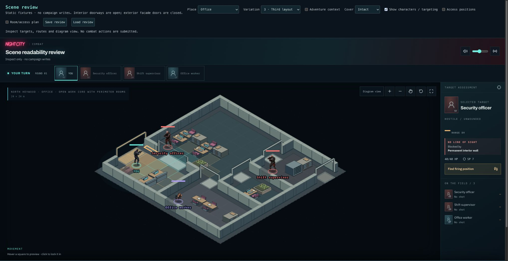
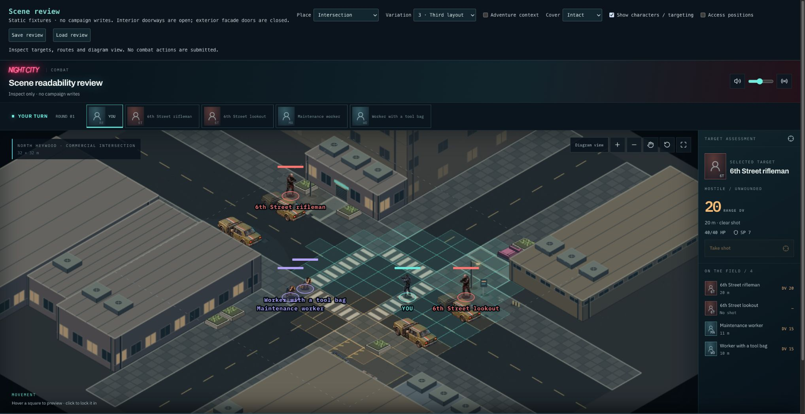

# Checkpoint 2B — functional areas

2B is implemented and ready for visual acceptance. Checkpoint 1 remains approved;
Checkpoint 2 remains open until 2C (nightclub groups and final acceptance review).

## What changed

- Office 1 and 3 use two opposed desk pairs with side filing; Office 2 uses two four-desk islands with shared filing. Chair-side aisles remain reserved. The groups use their authored facing so mirrored sprite presentation cannot put chairs against the shared desk edge.
- Reception has a raised visitor counter edge, separate visitor/staff floor strips, waiting seat with side table, and a clear transition to the office. Waiting and reception remain independently addressable adventure objects.
- Conference sections join into a table with seating; larger meeting rooms place a credenza against the perimeter. Equipment rooms pair a server rack with maintenance storage and clear access.
- Commercial entry paving joins the storefront/vendor customer approach. The workshop has an explicit marked handling apron and connection to the access lane, kept clear by the composer.
- Residential entrances get a framed approach; low commercial frontage gets a waiting arrangement beside the entry. Generic perimeter filler is reduced so these arrangements carry the identity.

The approved walls, floorplan topology, street dimensions, thresholds and building
masses are preserved. Floor treatments use optional saved `floorUse` metadata on
protected aisle zones and the shared renderer. No location-specific combat logic.

## Review checklist

Open `/scene-review`, choose **Furniture and detail**, and inspect **Office 1–3**
and **Intersection 1–3**, first without characters, then with targeting enabled.

| Area                | Look for                                                                                                                            |
| ------------------- | ----------------------------------------------------------------------------------------------------------------------------------- |
| Work pods           | Two distinct groups, desks facing across a shared edge, filing at the side, clear chair approaches. Office 2 has four-desk islands. |
| Meeting             | One joined table with chairs; Office 1/3 have storage against the room perimeter.                                                   |
| Reception           | Visitor approach, waiting group, staff side and onward route can be read separately.                                                |
| Support             | Rack and maintenance storage form one accessible equipment area.                                                                    |
| Commercial frontage | Entry and customer approach relate to the vendor; stock does not consume the walking line.                                          |
| Workshop            | Marked empty apron visibly belongs to unloading/handling and connects to service access.                                            |
| Quiet corners       | Framed residential entry and commercial waiting frontage have different uses.                                                       |
| Preservation        | Doors, sidewalks, crossings and local working aisles remain clear; characters and target readout remain usable.                     |

## Evidence and limits

3,506 tests across 261 files pass, including 32-seed checks for complete pods,
working-space preservation, floor reservations, snapshot round trips and adventure
bindings. Typecheck and production build pass. Lint has no errors and 12 existing
React-refresh warnings. Six furnished fixtures and actor/targeting views were
inspected in the shipping renderer.

This is a composition pass, not final art. The placeholder seating is still generic,
conference modules retain a visible join, and the quiet frontage identities are
subtler than the active vendor/workshop areas. The review should judge relationships
and usable space rather than raw prop count. Office generic planter filler has been
reduced rather than increased to make the functional arrangements legible.

No SQL migration. Existing snapshots remain valid and retain saved placement;
new recipes apply to newly generated scenes. Shared procedural art refinements can
also affect existing uses of that art.

| Variation | Office                                         | Intersection                                                 |
| --------- | ---------------------------------------------- | ------------------------------------------------------------ |
| 1         |  |     |
| 2         |   |  |
| 3         |     |  |

