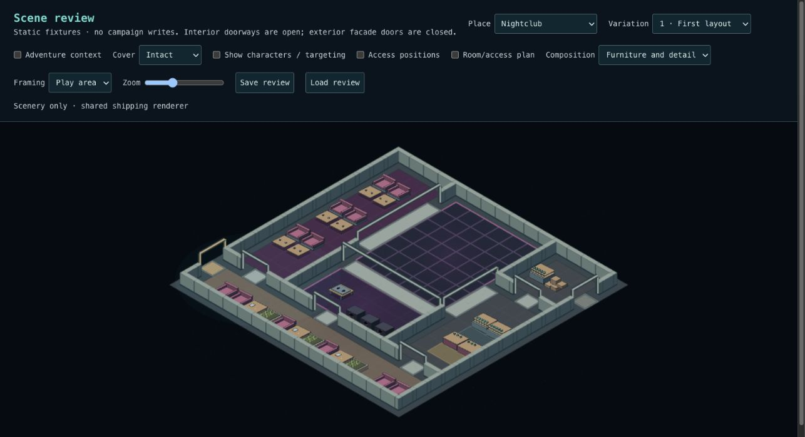
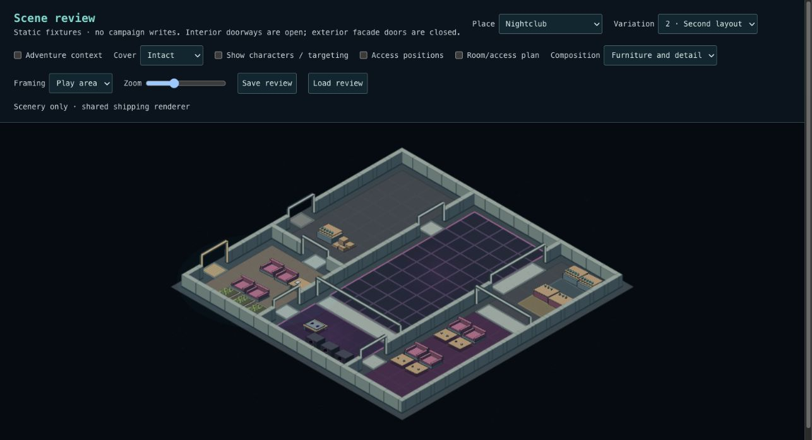
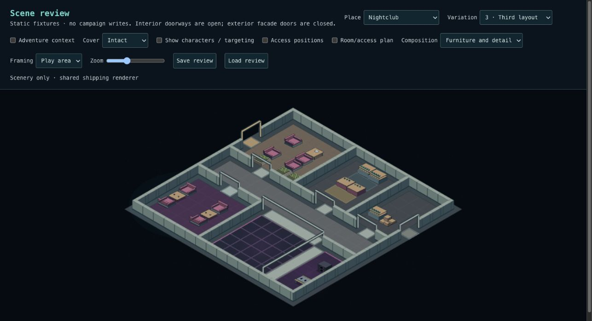
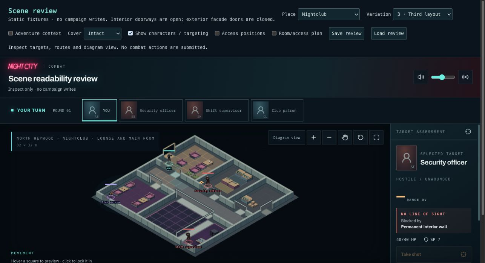

# Checkpoint 2C — nightclub functional areas

Implemented for review. Checkpoint 2 is awaiting visual acceptance, not marked passed.
No additional implementation subphase is planned within Checkpoint 2 unless review
finds a concrete gap.

## Arrangements

- **Staffed bar:** one continuous four-metre counter, two backbar storage sections, a two-metre staff aisle, a distinct customer strip, and a clear route around the counter end. The counter/storage arrangement is required as a whole, not separately scattered sections.
- **Lounge benches:** paired seats face low tables, with a shared side approach. Used along the seating edges in Nightclub 1 and 2.
- **Conversation seating:** opposed seats share one low table and an accessible side aisle. Two groups in Nightclub 3 establish a different lounge arrangement.
- **Service stock:** bottle storage and beverage supplies share a protected restocking approach. This replaces unrelated perimeter storage placement.

Shared cluster placement handles bounds, collisions, access and connectivity.
The bar customer/staff/end-access zones persist in the snapshot and remain protected
from later placement. New art ingredients (backbar, low table) use the common
procedural texture and destruction path. Adventure bar, seating and freight facts
bind to the new groups. No new combat engine or location-specific renderer branch.

## Review Nightclub 1–3

In `/scene-review`, use Furniture and detail, initially without characters.

| Criterion    | Pass means                                                                                                                                           |
| ------------ | ---------------------------------------------------------------------------------------------------------------------------------------------------- |
| Bar          | Counter and backbar read as one functional area; customer and staff sides are clear.                                                                 |
| Access       | A person can approach the counter and reach the staff aisle around its end; no doorway is consumed.                                                  |
| Seating      | Seats face their tables and form separate groups, with usable approaches. Variation 3 has opposed conversation groups rather than another bench row. |
| Service      | Storage and stock belong together with reachable handling space.                                                                                     |
| Preservation | Dance floor, entrances, room connections and principal routes remain clear.                                                                          |
| Characters   | Enable targeting; characters, destinations and obstruction feedback remain readable.                                                                 |
| Persistence  | Save review, change variation, then Load review: the original furnishings, geometry and actor positions return.                                      |

For final **Checkpoint 2** acceptance, also apply the [2B checklist](checkpoint-two-b.md)
to Office and Intersection 1–3. Each functional arrangement should answer what
someone does there, where they stand and how they reach it. Merging code is not
by itself a visual pass.

## Validation

- 3,510 tests across 261 files pass; typecheck and production build pass.
- Lint: zero errors, 12 existing React-refresh warnings.
- 32-seed nightclub checks cover complete bars, joined counter geometry, backbar relation, clear floor reservations, at least two lounge groups, empty dance floors and snapshot round trips.
- Named adventure bar/seating/freight bindings survive save/read.
- Baseline comparison: 64 Office/Intersection scenes are identical to merged 2B; 32 nightclub structure/entrance/connection sets are preserved.
- Inspected furnished Nightclub 1–3, actor/targeting view at the browser's smaller desktop width, destroyed art, and the Save/Load review flow.

No SQL migration. New recipes apply to new scenes; saved scenes retain their
placements. Existing bar art also gets joined countertop edges.

## Critique and boundaries

The bar and seating relationships are substantially clearer. This remains placeholder
art: backbar bottles and lounge furniture are deliberately simple. Service stock is
a compact functional group, and the large service room in variation 2 remains
sparsely programmed. Reception and performance retain their previous furnishings;
this pass does not redesign the nightclub's room program or add density to fill every
space. If the review requires a more substantial preparation/cleaning area, treat
that as a specific recipe correction before approving Checkpoint 2.

