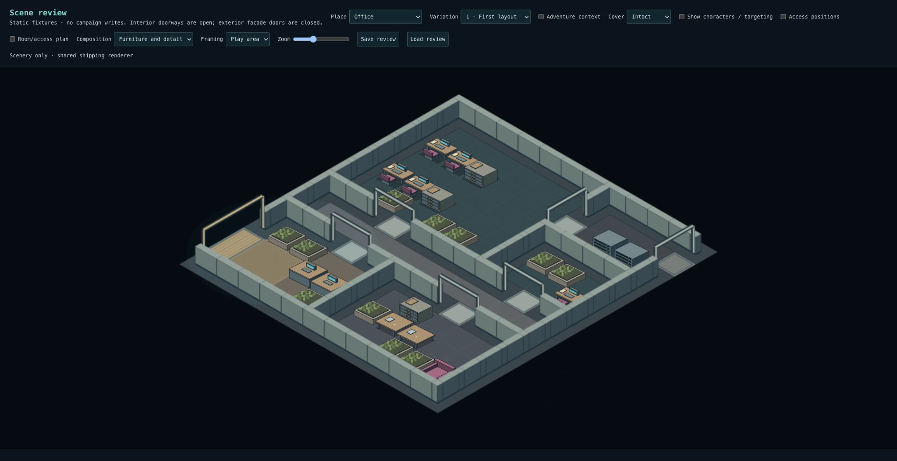
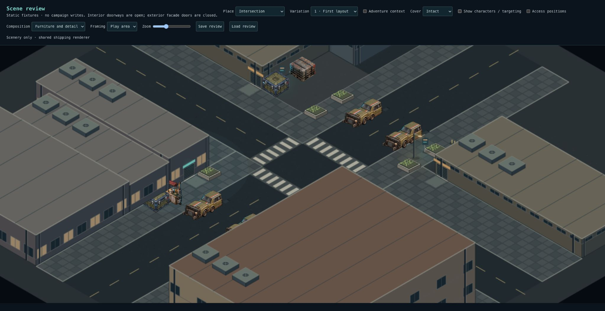
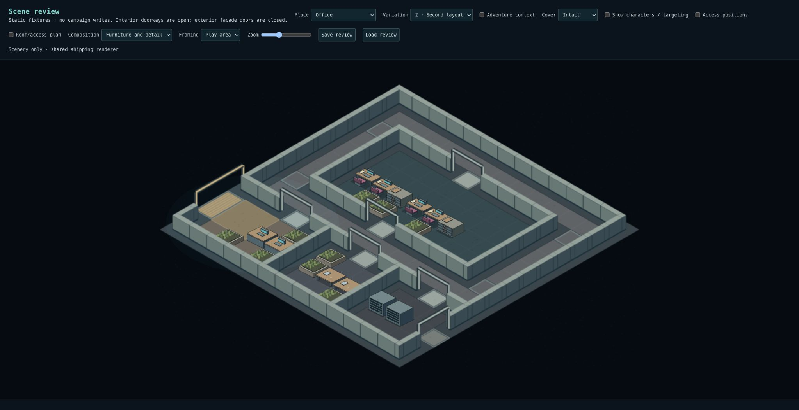
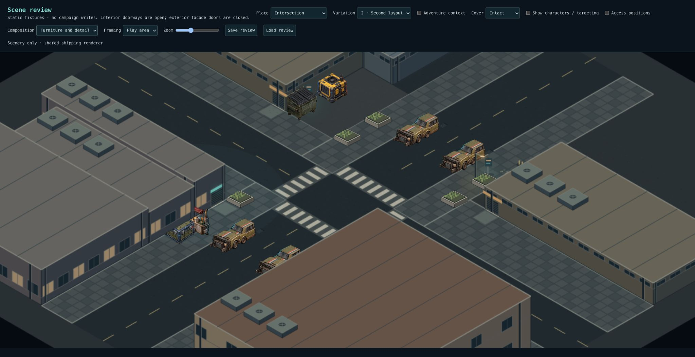
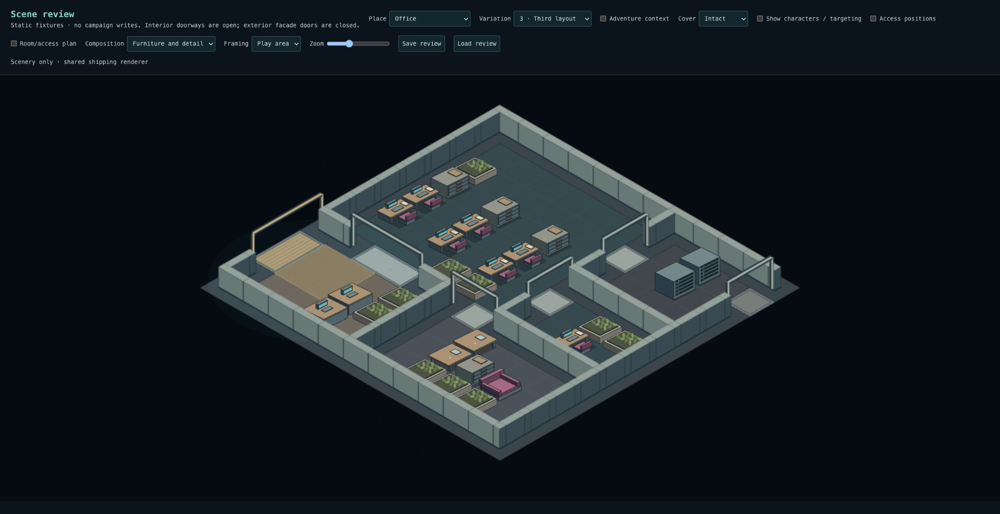
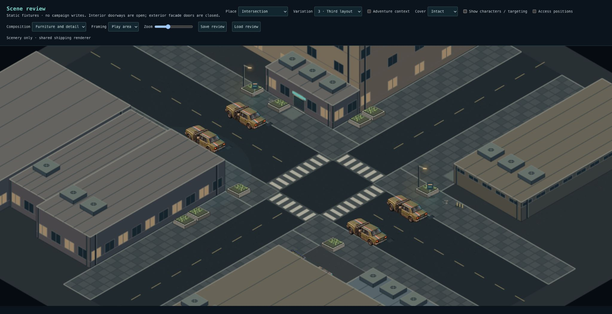
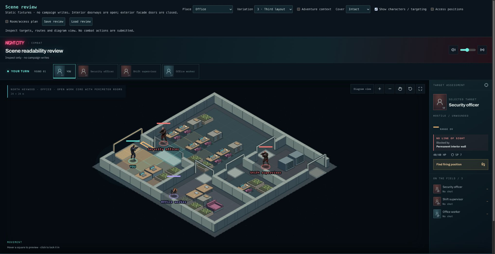
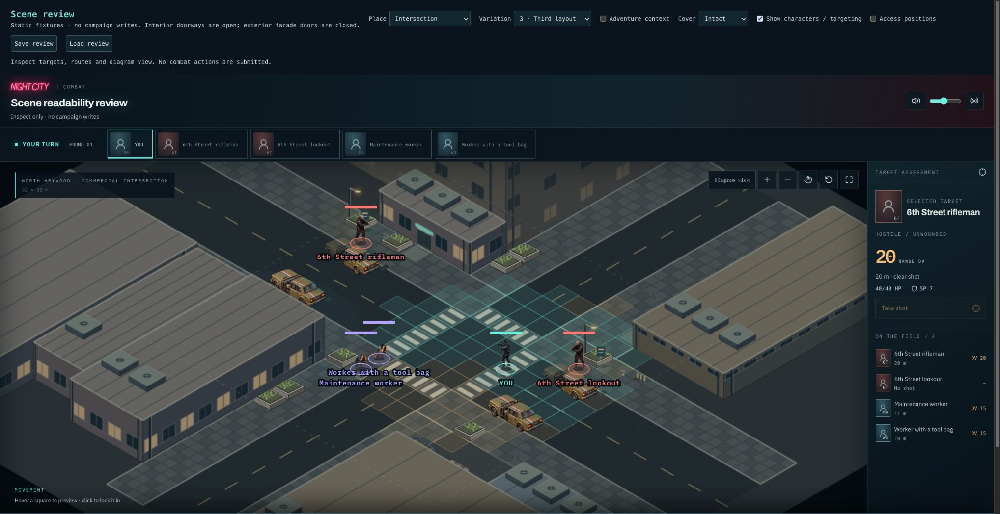

# Checkpoint 2A: coordinated activity groups

Checkpoint 1 was approved on 2026-10-03. Its structure, circulation and threshold
geometry form the baseline for this work. This is the first activity-group PR,
not completion of the whole second checkpoint.

## What changes

- Main office workspaces now place complete pods: two desks, shared filing and a
  continuous protected working aisle. The later pass no longer scatters individual
  desks/cabinets into those rooms. Private offices retain their compact furniture.
- Larger meeting rooms place their table and nearby storage as one group. The
  smaller loop-layout meeting room retains its compact table and two approaches.
- The intersection vendor has physical stock behind the cart and a reserved customer
  space beside the public pedestrian route.
- The workshop court selects a complete delivery or maintenance group, with an
  adjacent handling aisle. Contextual freight/utility facts can still select either.
- Outdoor cluster access is saved as existing aisle zones. Later placement passes
  respect it even after a snapshot round trip. Interior groups use existing saved
  access anchors. All groups use the same deterministic placement and connectivity
  checks, existing props and shared renderer.
- Adventure object bindings recognize the new groups, including workers assigned
  to named workstations, vendors, freight or utility activity.

## Preservation and validation

| Fixture        | Approved checkpoint 1 cover sections | Checkpoint 2A cover sections |
| -------------- | -----------------------------------: | ---------------------------: |
| Office 1       |                                   28 |                           26 |
| Office 2       |                                   22 |                           21 |
| Office 3       |                                   28 |                           28 |
| Intersection 1 |                                   23 |                           23 |
| Intersection 2 |                                   23 |                           23 |
| Intersection 3 |                                   21 |                           22 |

Section counts are not a quality score: these groups replace or coordinate existing
furnishings rather than pursuing density. Structures, primary entrances, room
connections, road widths, crossings and facade geometry are unchanged.

3,500 tests across 261 files pass; typecheck and production build pass. Lint has
zero errors and 12 pre-existing warnings. Tests cover complete pods, clear and
reachable working space over 32 seeds, preserved circulation, persisted exterior
reservations, deterministic snapshots and adventure fact bindings. The six furnished
fixtures below were inspected in the shipping renderer; Office 3 and Intersection 3
were also checked with characters/targeting enabled.

No SQL migration or new snapshot format. Existing saved scenes retain their
furnishings; these recipes apply to newly generated scenes.

## Review

In `/scene-review`, choose Office and Intersection variations 1–3, Furniture and
detail. Check that desks and filing read as a work group; that customer/handling
space is clear beside the vendor and workshop objects; and that the approved
entrances and routes remain readable. Enable characters to check targeting.

| Variation | Office                                       | Intersection                                               |
| --------- | -------------------------------------------- | ---------------------------------------------------------- |
| 1         |  |        |
| 2         |   |     |
| 3         |   |  |

## Remaining checkpoint 2 work

Update: [Checkpoint 2B](checkpoint-two-b.md) addresses the office and intersection corrections below. This document records the original 2A delivery.

Reception/waiting and support rooms still need more coherent activity groups;
nightclub bar/seating/service groups follow. The current planter-heavy perimeter
pass is still generic, and the small meeting room does not yet have a complete
seating program. These are furnishing issues, not reasons to reopen the approved
floorplans. This PR establishes the first reusable groups and their preserved
working space; it does not claim finished environmental composition or final art.
