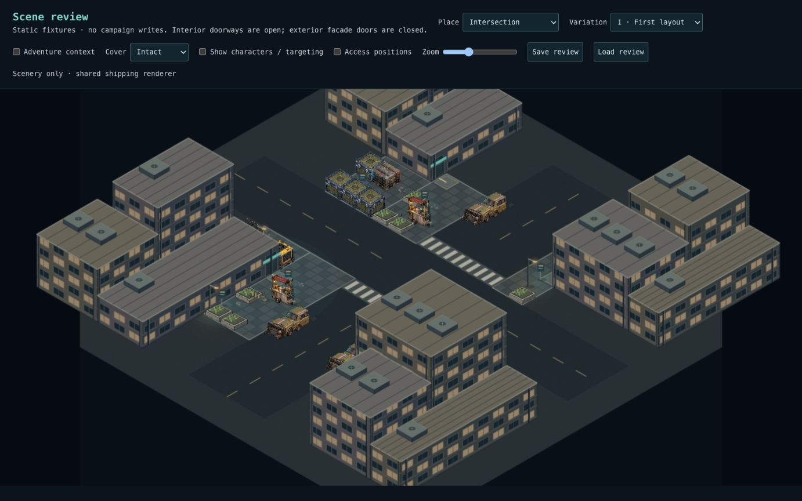
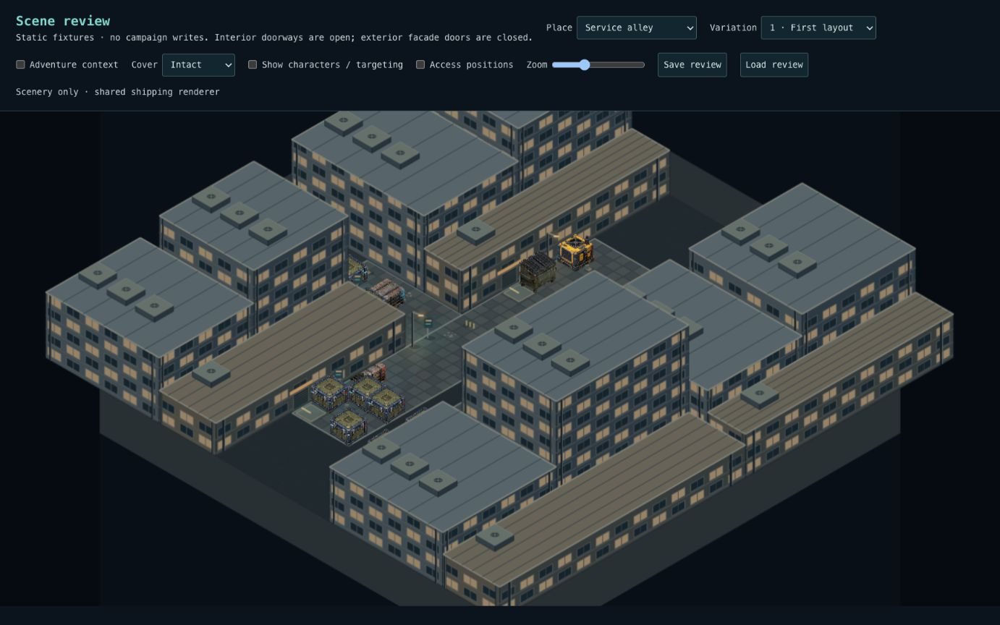
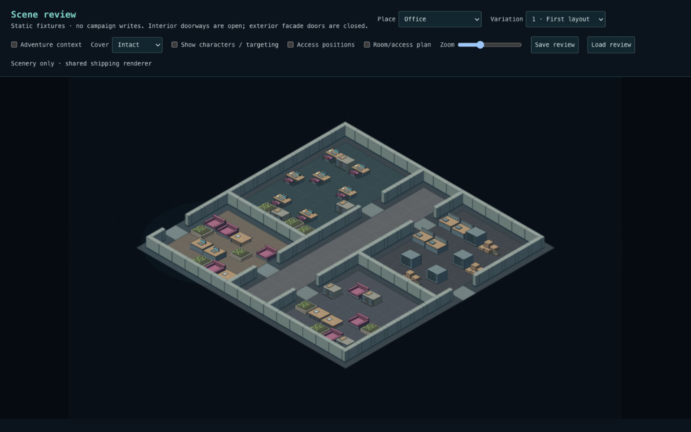
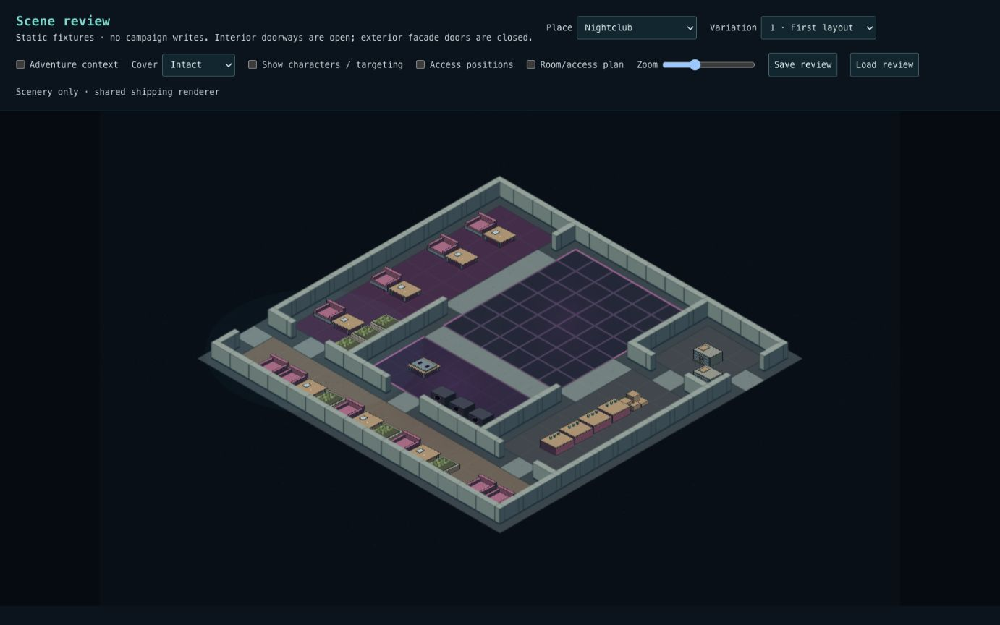

# Composition quality review

The prior phases established reusable placement and persistence, but their
screenshots did not justify calling the environments visually complete. This
pass responds to the intersection, alley, office and nightclub scene-review
feedback. Default density is concentrated around activity and edges; doorways,
working approaches, corridors, dance floors and connecting routes stay clear.

## Changes

- Exterior parcels have three differently sized/heighted wings and a rear
  setback instead of one repeated box. Entrance-bearing wings retain their
  frontage. Heights range from 3–11m; upper structures remain inaccessible.
- Alley envelopes narrow from 12–20m to 12–16m, including service strips. Extra
  stock and frontage planters occupy constrained edge slots.
- Rooms mix primary furniture with waiting/table groups, storage, plants,
  maintenance benches and supplies. Desks include chairs and working clutter.
  Nightclubs have continuous bar runs and reinforced audio stacks.
- Candidate placement rejects disconnected interior floor and inaccessible
  reserved exterior positions before committing an object. It uses the same
  grid obstacles as movement; it never silently deletes a required cluster.
- New interior recipe version 4 uses half-metre walls joined through blocked
  tile centres. Navigation remains on the existing 2m lattice; sub-tile wall
  margins are not additional standing positions. Shots use actual wall solids.
  The saved-scene reader checks wall continuity as well as room coverage.
- Wall artwork sorts in short depth slices. Structure textures use their own
  bounds, avoiding clipped tall roofs and unnecessary full-scene wall canvases.

## Screenshots

All are actual shared-renderer captures without characters, variation 1.

## Verification and rollout

- 3,485 tests across 257 files pass, including density/diversity floors,
  deterministic layouts, adventure fact binding, corruption rejection,
  reachability, rotation/destruction and snapshot round trips.
- Typecheck and production build pass. Lint has zero errors and the existing
  twelve React refresh warnings.
- Browser review covers all three variations of the four requested locations,
  saved review restoration, and narrow-screen scenic target selection with
  structure fading. [Mobile capture](composition-quality/mobile-targeting.png).
- Legacy recipe version 3 walls load without regeneration. Existing campaign
  geometry stays frozen; new compositions use the changed recipes.
- No new SQL migration is required. The existing database envelope accepts
  environment version 1 and stores resolved geometry; recipe version is inside
  that envelope. SQL lifecycle fixtures are generated from the new composer;
  database execution remains covered by the PR's migration-replay CI.

## Critique and remaining work

This is a stronger playable blockout, not the finished reference look. Facades
still repeat window and roof motifs; exterior painted props and procedural
interior furniture still have different art styles. Long streets and floors
still need richer small-scale surface detail. Large buildings obscure scenery
in the character-free view; combat uses fading and target controls to keep
actors selectable. Wider unique facade kits, alternate-facing furniture art,
lighting and more specific business identities remain the next visual work.

After merging, compare each location in `/scene-review`, characters off first.
Check whether density and activity read correctly, then enable characters and
inspect routes and targets. Existing saves intentionally keep their old layout.
A normal deployed campaign encounter remains the final integration playtest.
