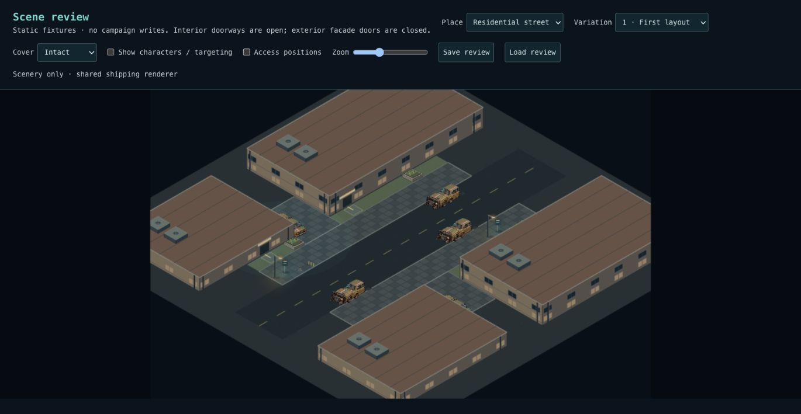
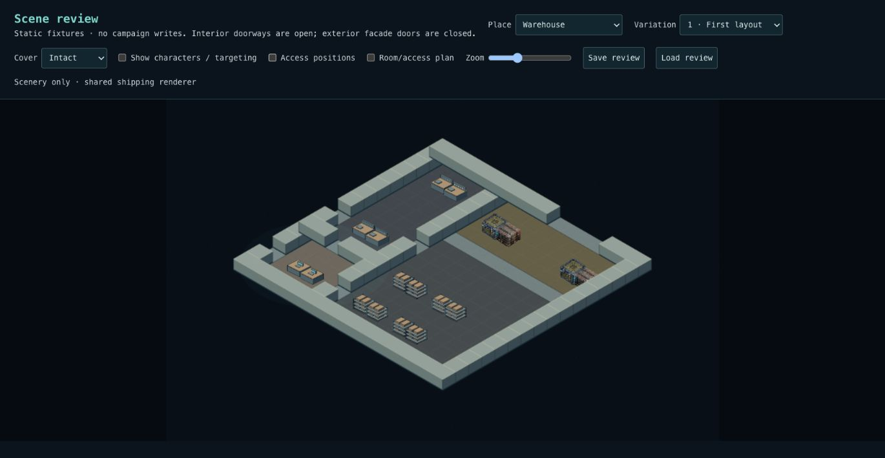
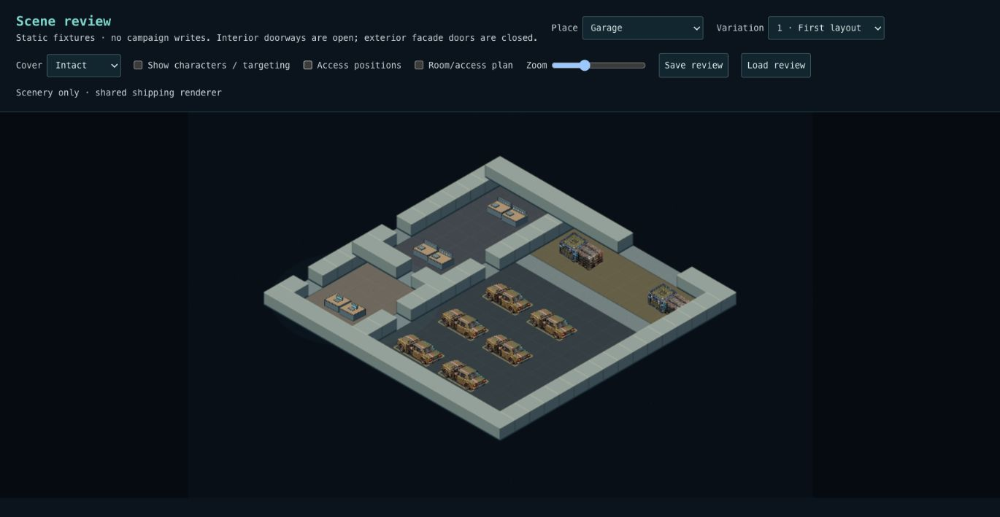
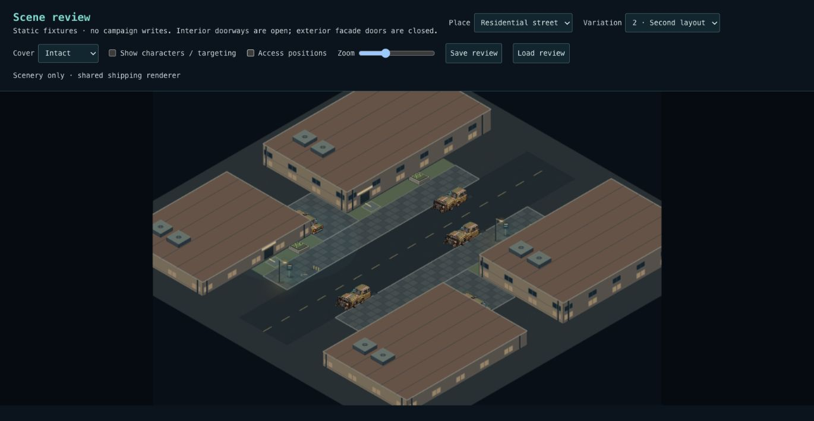
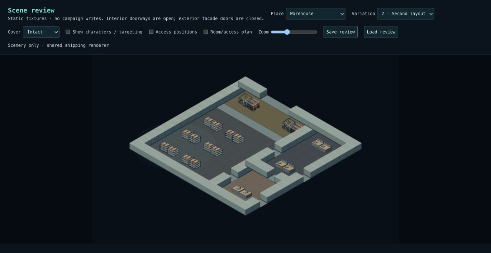
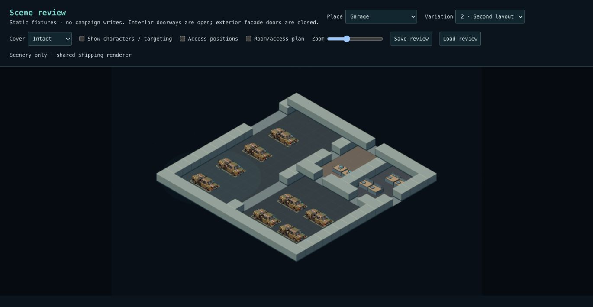
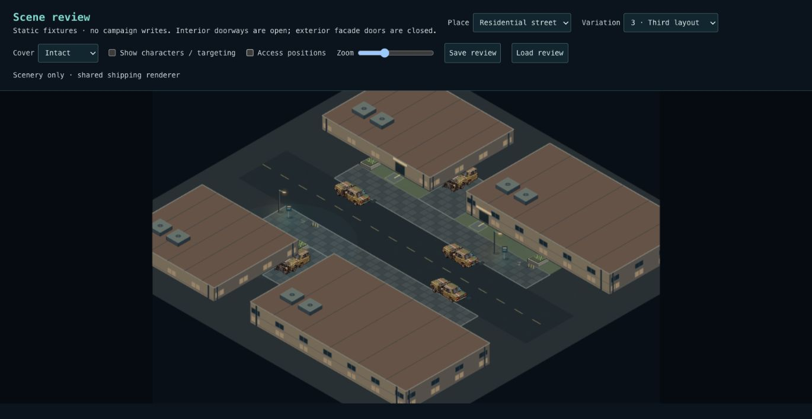
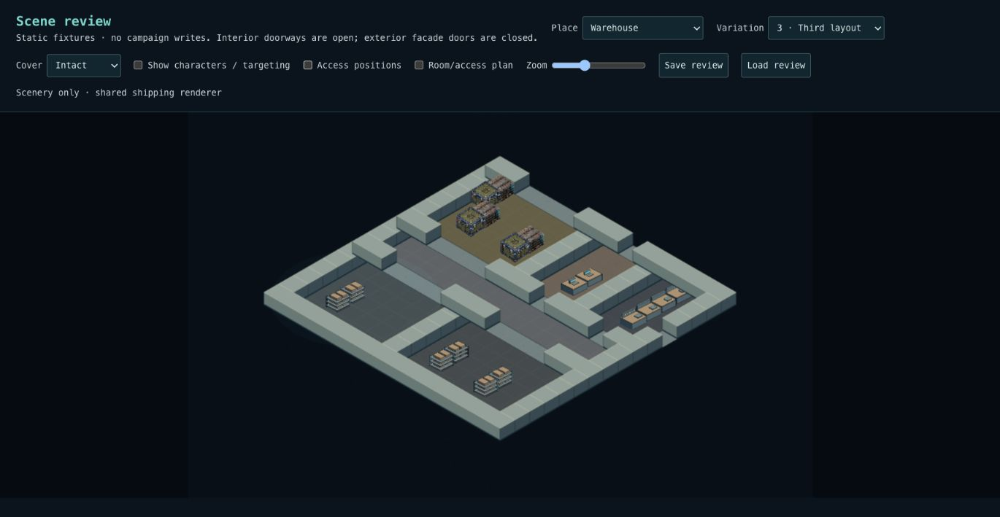
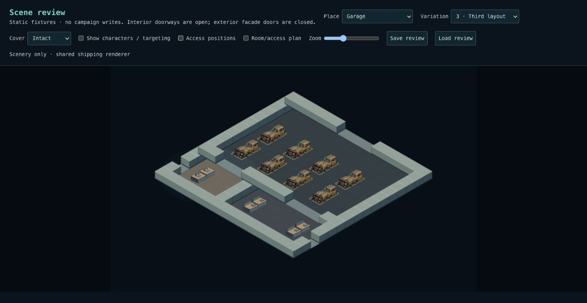
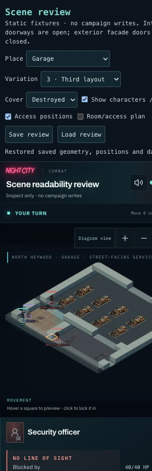

# Residential, warehouse and garage extension

Nine additional authored layouts reuse the shared composer and shipping renderer.
Together with office/nightclub, this adds fifteen layouts to the Phase 1 proof.
The review menu now offers seven environment families with three variations each.

| Environment | Organization | Reused constraints |
| --- | --- | --- |
| Residential | Setbacks, offset driveways, cross-axis street | Curb alignment, driveway orientation, clear sidewalks and closed facade approaches |
| Warehouse | Receiving hall, side office/loading apron, cross-aisle stockrooms | Storage racks, freight handling space, wide loading openings, office/service rooms |
| Garage | Shared vehicle hall, twin halls, street-facing bays | Vehicle work space, reception, service benches, wide entrances |

The only new catalog object is a two-section workshop bench cabinet. Shelves,
freight, cars and planters reuse existing cover definitions. Reusable rack,
bench and planter art plus floor materials/bay markings extend shared primitives;
there is no environment-specific renderer or combat engine. Vehicle engine and
cabin sections retain independent HP after rotation and destruction. Upper
structures remain decorative, without walkable roofs, balconies or tactical height.

## Evidence

3,458 tests across 253 files pass locally. Type checking and production build pass;
code lint has zero errors and twelve existing Fast Refresh warnings. Multi-seed
checks validate deterministic snapshots, reachable actors/front doors, room-wide
connectivity, contextual clusters, clear working space and loading openings.
All fifteen new layouts feed the database lifecycle replay in CI: stage, enter,
move/damage, save, complete and revisit. No additional SQL migration is required.

All nine extension layouts were captured without characters. Garage variation 3
also restored destroyed cover and alternate actor positions through Save review →
refresh → Load review; its shared combat renderer was inspected at phone width.

| Variation | Residential | Warehouse | Garage |
| --- | --- | --- | --- |
| 1 |  |  |  |
| 2 |  |  |  |
| 3 |  |  |  |

## Review and rollout

Use `/scene-review` to inspect all variations, room/access plans, destruction and
character readability. `/combat` exposes the actual persistent fixtures. After
deployment, use a test campaign to enter each family, move, damage cover, reload,
finish combat and verify the saved aftermath. Disposable SQL replay and static
browser checks do not replace this deployed acceptance pass.

Merge the office/nightclub foundation PR before this extension. Both rely on the
already-applied Phase 1 database contracts; no new manual SQL is needed. Older
clients reject recipe v3 instead of reinterpreting a saved scene.

These are playable spatial/art blockouts. Dedicated painterly facings, richer
residential identity, lighting, small clutter and recipe density tuning remain.
Rooms use open doorways and permanent walls. Automatic campaign generation,
interactive doors and tactical height remain separate work.
