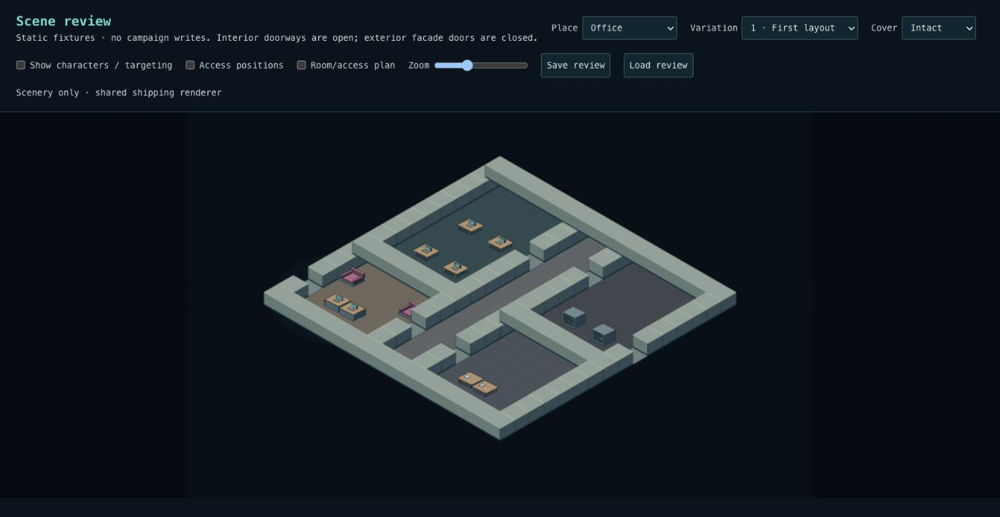
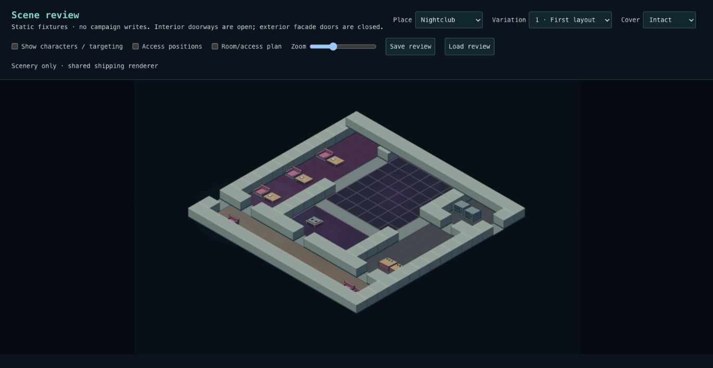
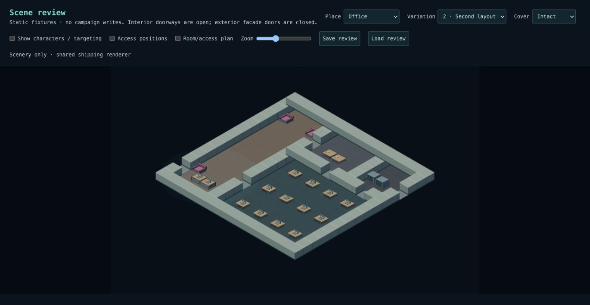
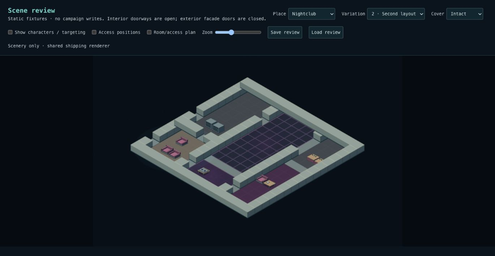
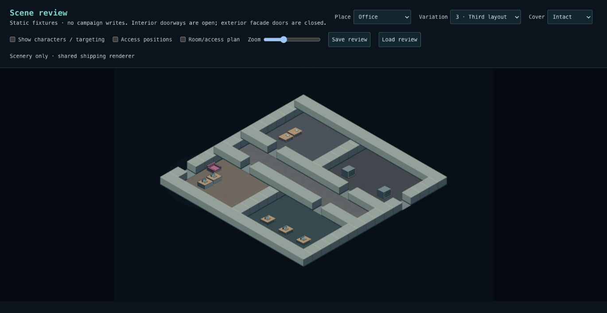
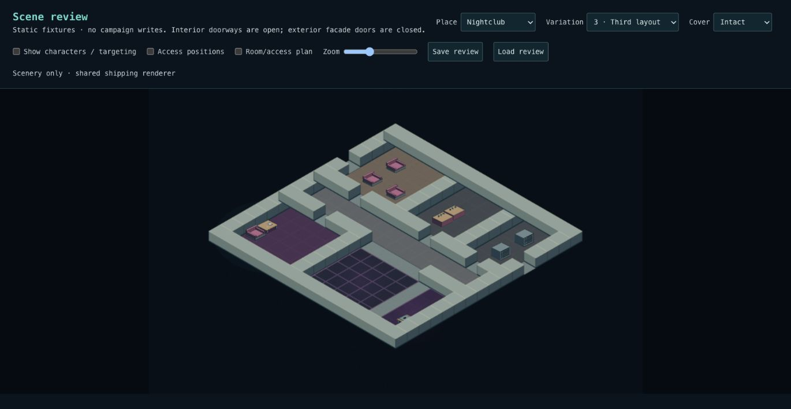
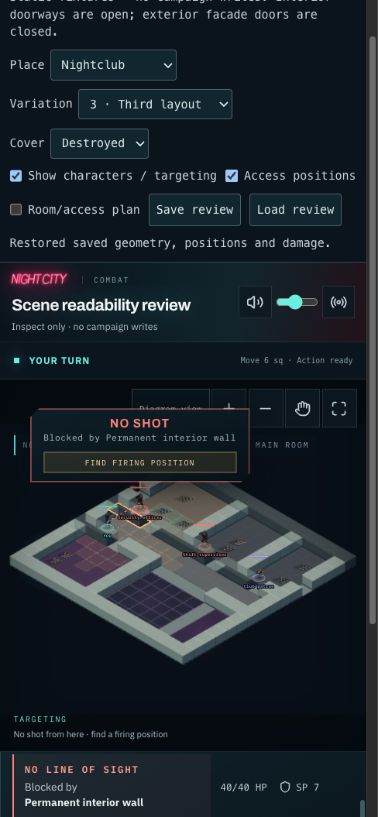

# Phase 2 — office and nightclub

Three office and three nightclub layouts now use the same composer constraints,
cluster placement, cover sections, renderer and combat loop as the outdoor proof.
The office organizations are central corridor, open work floor, and private room
suite. The club organizations are central dance floor, long room, and lounge/main
room. These are bounded authored recipes, not arbitrary prose generation.

## Review

Open `/scene-review`, choose Office or Nightclub, and try variations 1–3 without
characters. Room/access plan shows saved rooms, openings and working-space anchors.
Enable characters to inspect targeting, diagram view, zoom and alternate access
positions. Save review, refresh, Load review preserves geometry, damage and poses.
This page writes only browser review storage. `/combat` stages the actual fixtures
in a test campaign through the existing persistent scene flow.

| Layout | Office                                                 | Nightclub                                                     |
| ------ | ------------------------------------------------------ | ------------------------------------------------------------- |
| 1      |  |   |
| 2      |   |             |
| 3      |     |  |

## Contracts

- `interiorRecipes.ts` authors rooms and their opening connections. The complement
  of the floor plan becomes permanent wall segments on the existing 2m grid.
  Walls are shown cut down; their full blocking footprints remain visible.
- Openings reserve their full width and both approaches. Public and service
  openings at the boundary reserve their in-bounds approach. They do not introduce
  a new travel/retreat action. All doors are permanently open in this milestone.
- `sceneClusters.ts` is extracted from the outdoor composer. It fits entire
  clusters into allowed zones using bounded frontage/work-bank candidates and
  reserves staff/customer/seating access before adding later objects. Required
  clusters fail explicitly. Optional furniture can be omitted.
- Dance floors, corridors and openings exclude furniture. Desks, counters, booth
  seats and tables use existing 2m cover sections and frozen material HP. New
  material assignments/footprints are documented house judgements in the catalog.
- The environment reader validates room references, opening adjacency and clear
  approaches, unique access IDs, floor/wall coverage and legal furniture. The
  battlefield reader verifies every open interior tile remains reachable.
- Recipe v3 adds saved `interior` connections/access. Battlefield snapshot stays
  v2, environment/outer scene manifest stay v1, and deployed SQL already preserves
  the complete JSON. Older clients reject the unknown recipe version rather than
  reinterpret it. Existing scenes are read as saved, never recomposed.
- `interiorPropArt.ts` is a provisional reusable furniture kit with intact,
  damaged and wrecked states. Ground materials and cutaway walls extend the same
  composition renderer. No office/nightclub renderer dispatch exists.

## Verification and deployment

3,443 tests across 252 files pass. TypeScript, production build and code lint pass
(12 existing Fast Refresh warnings). Multi-seed tests cover room/access and actor
reachability, clear openings/dance floors, snapshot round trips and corruption.
Existing hostile navigation finds firing lanes through all six arrangements;
wall blocking survives furniture destruction. Historical outdoor fixtures remain
covered. Desktop captures and a 390px mobile targeting review use the shipping
renderer. Browser Save → refresh → Load restored the nightclub's destroyed
furniture and alternate access positions.

CI generates SQL from all six production layouts with `tools/scenes/interior-sql.ts`
and tests staging, entry, movement/cover saving, completion and revisit in a
rolled-back database transaction. PostgreSQL is unavailable in the local workspace;
CI is the database gate. **No new SQL migration is required.**

After deployment, use a test campaign to enter an office and a nightclub, move,
damage furniture, reload, finish combat and confirm the durable aftermath. Local
browser review and disposable SQL tests do not substitute for deployed acceptance.

## Scope

This is a playable spatial/art blockout. Painterly furniture, richer wall finishes,
small clutter, lighting polish and fine-scale footprint tuning remain art work.
There is no fog-of-war/room discovery, interactive lock/door system, walkable
balcony, second floor, destructible structural wall or automatic adventure hookup.
Any future elevated structure is decorative until tactical height is designed.
Residential streets, warehouses and garages are the next environment extension.
