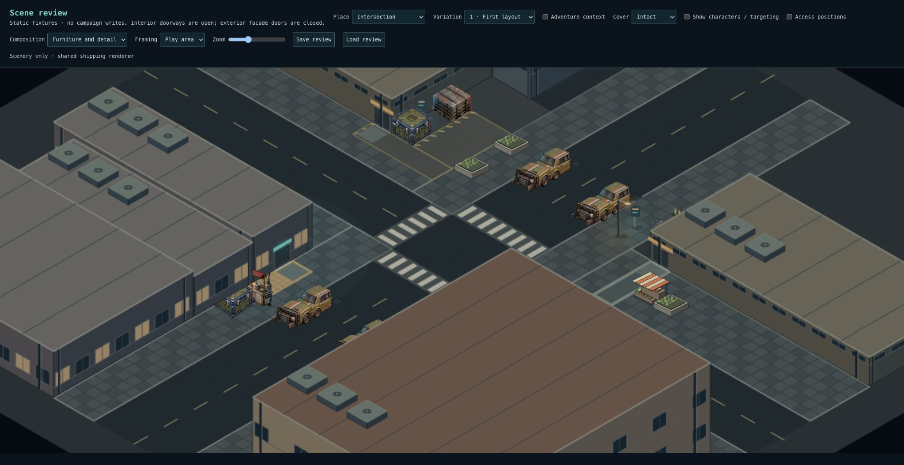
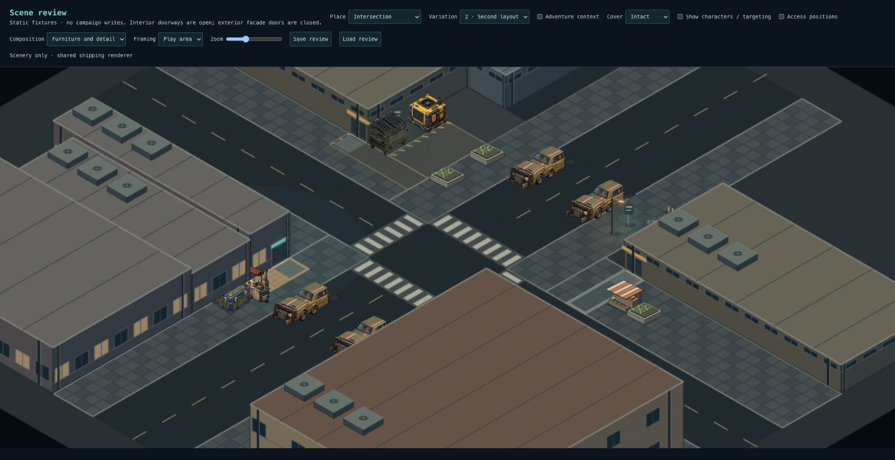
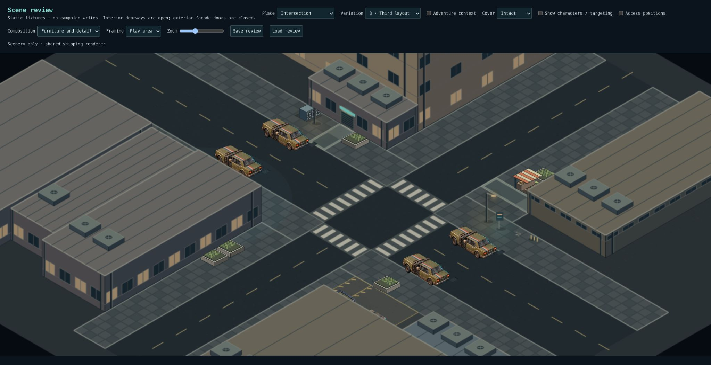
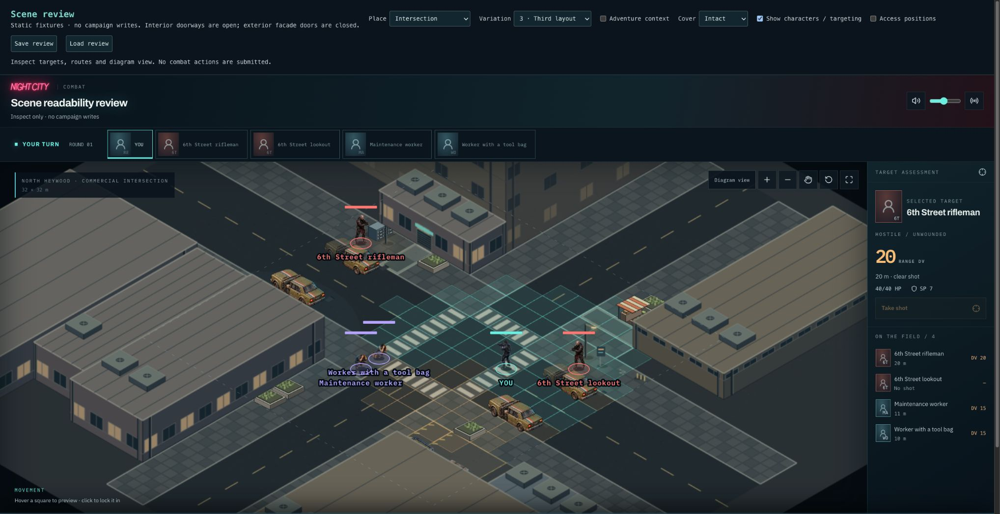

# Intersection frontage corrections

Focused follow-up to Checkpoint 2. Office is accepted and unchanged.

- The shop/vendor customer reservation is now an eight-square-metre paved forecourt, extending to the shop entrance. Its warm paving stays beside the grey two-metre through-sidewalk, not across it.
- The residential entrance replaces one planter with an apartment mailbox bank.
- The low commercial frontage replaces its bench with a small merchandise display. Each quiet corner still has exactly two placed props.

Both new cues use existing storage collision/destruction behavior and shared procedural art. No structure, street, doorway, vehicle or through-route is moved. No SQL migration. New composition applies to new scenes; saved scenes keep their placements.

## Review

Use Intersection 1–3 in `/scene-review`, Furniture and detail:

1. Where the vendor is present, distinguish its warm customer forecourt from the continuous grey public sidewalk.
2. Identify residential mailboxes versus the low shop's striped merchandise display. Both corners should remain sparse.
3. Enable characters and confirm routes and targeting remain readable.

The mailbox is clearest in variation 3; the foreground housing mass obscures that facade from the fixed scenery camera in variations 1–2. This pass does not alter the accepted buildings or camera. These remain placeholder cues for later artwork polish.

## Validation

- 3,511 tests across 261 files pass; typecheck and production build pass.
- Lint: zero errors, 12 existing warnings.
- Across 32 seeds, the forecourt remains free of cover and separate from the through-walk; quiet groups retain two props each.
- Baseline comparison across 32 seeds: Office and Nightclub scenes are identical; Intersection structures, through routes and prop counts are preserved.
- Furnished Intersection 1–3 and scenic actor/targeting view inspected.

