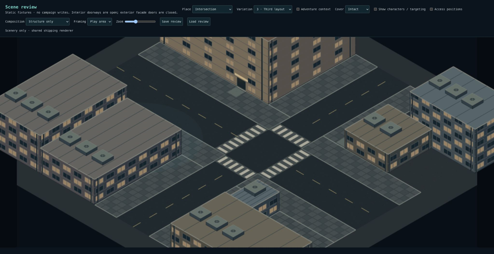
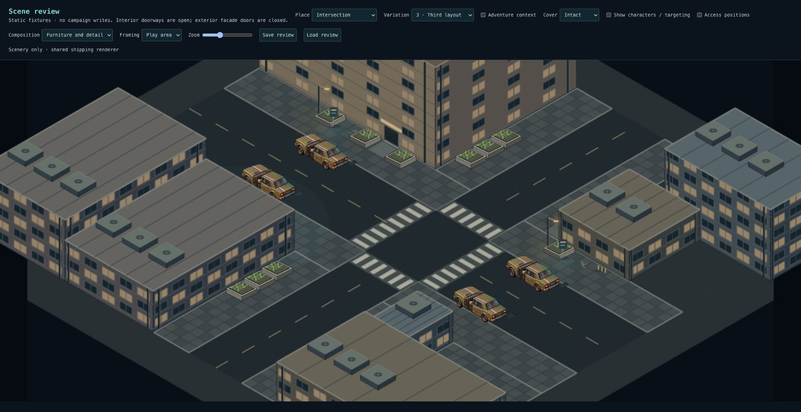
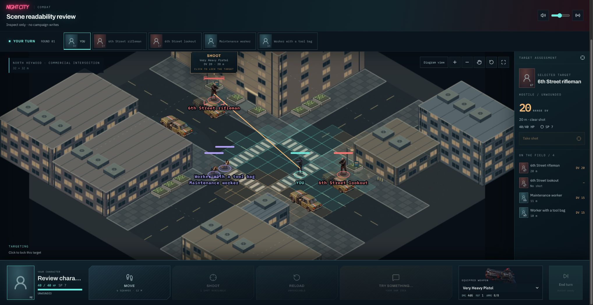

# Checkpoint 1B — intersection parcels and pedestrian routes

The compact local-intersection profile coordinates an 8m street (4m travel plus
two 2m curb lanes), a 6m cross street, 4m sidewalks and frontage footprints. Roads
occupy 39.1% of the 32×32m playable area, down from 48.4%. This is a local-street
profile, not a universal width rule for future boulevards or industrial roads.

The corners retain four authored identities: attached retail frontage, a taller
apartment block, a workshop return enclosing a service court, and a low utility
building attached to a neighboring block. Building footprints now meet continuous
pavement along both street axes. Roads, sidewalks and buildings extend beyond the
playable boundary. The service court is separate from the public walking line.

Four crossings meet reserved pedestrian landings. Saved aisle zones protect 2m
through-walks, facade approaches and the 4m vehicle travel lane during every prop
placement pass. Required cars and the vendor remain; denser furnishing cannot
consume these routes. Facade-connected sills replace the yellow entrance boxes.
Entrances remain closed building boundaries, not interactive interior transitions.

## Review

In `/scene-review`, compare Intersection variations 1–3 with Structure only. Trace
an entrance to a sidewalk, across a crossing and to another entrance. Check how
pavement continues along both streets and off-screen. Restore furniture and
characters: verify the same routes remain clear and targets stay selectable.

## Validation and limits

- 3,492 tests across 260 files pass. New 32-seed checks trace routes strictly
  through sidewalk/crosswalk cells with furniture present, reach every entrance
  and crossing, verify continuation to all four boundaries, and reject overlap
  with reserved routes. Existing snapshot, placement, rotation, destruction and
  adventure-context tests also pass.
- Typecheck and production build pass; lint has 0 errors and 12 existing warnings.
- Visually reviewed all three structural variants, populated scenes and desktop
  targeting. Large foreground masses can obscure scenery until the shared actor
  occlusion treatment fades them; Overview remains available.
- No SQL migration. Existing saved layouts keep their geometry.

This is the 1B review gate. The four corner identities are currently authored in a
fixed combination; seeds vary junction position, orientation, heights and some
contents. Later variation work must choose and combine more corner programs and
arrangements, not merely shuffle props. Activity groups, fences, frontage detail
and artwork polish remain subsequent checkpoints. Deterministic composition means
new scenes can vary while a saved scene reloads identically.
