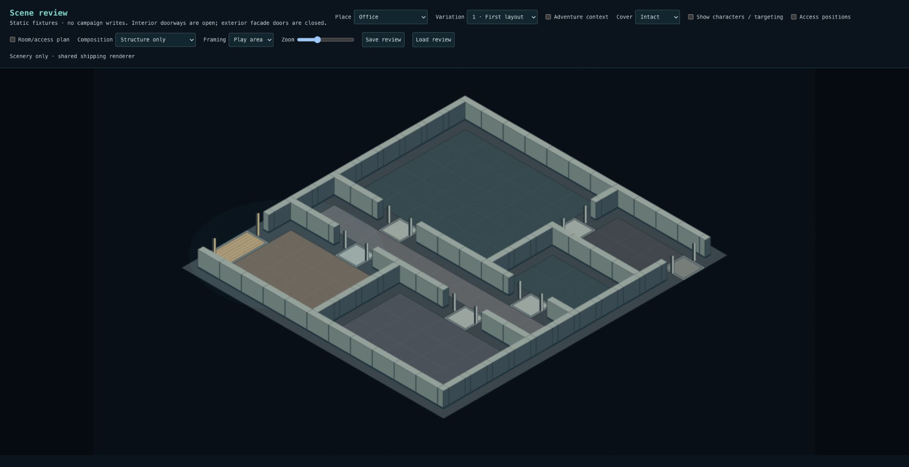
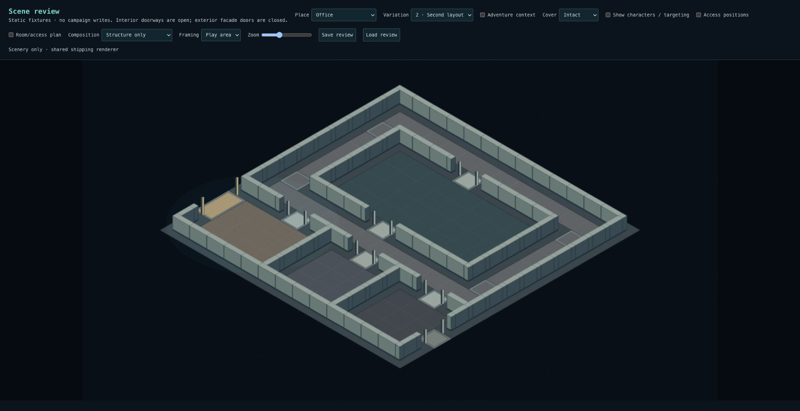
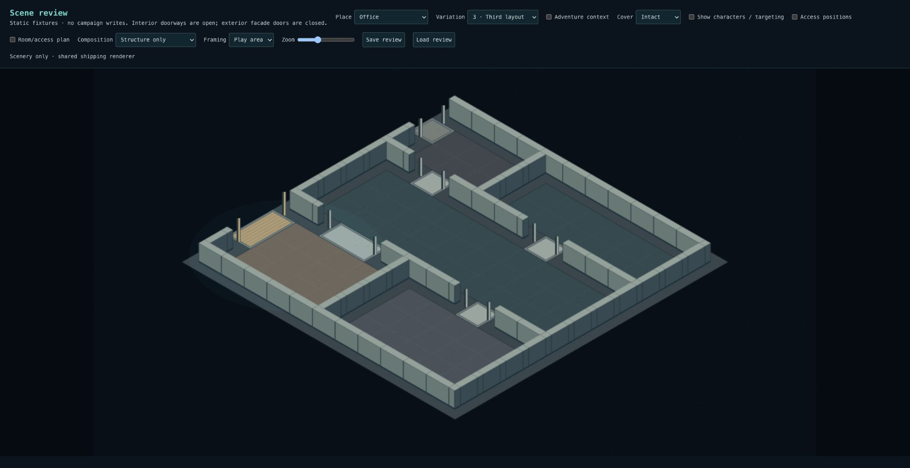
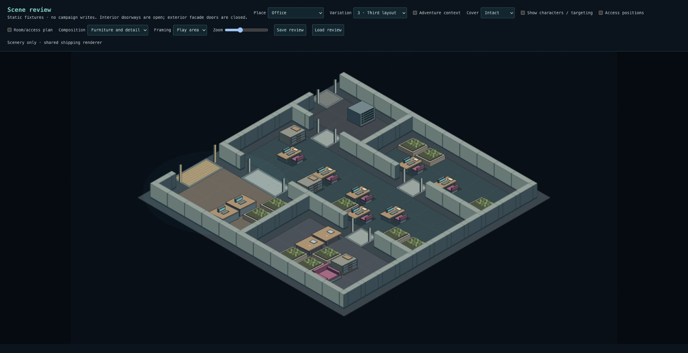

# Checkpoint 1A — office organization and entrances

Replaces the three similar office partition plans with three distinct connectivity
patterns, using the existing deterministic composer, grid and cluster placement.

| Review variation | Organization     | Floorplate | Program                                                                                               |
| ---------------- | ---------------- | ---------- | ----------------------------------------------------------------------------------------------------- |
| 1                | Branching spine  | 24×26m     | Reception/meeting before the corridor; larger staff workspace, small enclosed office and support room |
| 2                | Circulation loop | 28×28m     | Visitor rooms at the front; a continuous alternate route around the central work floor                |
| 3                | Open core        | 24×24m     | Workspace connects reception, meeting, enclosed work and support rooms; no main corridor              |

Support rooms are 24–36m², reception 48m², meeting 36–60m², and the main
workspaces 120–128m². These bounded programs accommodate the existing 2m tactical
grid and furnishing access requirements; this is not a general building-design
solver. The loop deliberately allocates more floor area to circulation.

Each primary entrance is selected in its plan, is 4m wide, and opens onto a saved
4×4m arrival aisle. Furniture cannot consume that landing. Secondary service exits
remain 2m wide. The player starts on the interior approach to the primary entrance.
Existing doorway approaches and connectivity checks protect room transitions.

Shared interior rendering derives threshold trim from saved connections: a warm
main-entry mat, contrasting room/service sills and narrow jambs. Corridor joins
remain open passages. The treatment applies to other saved interiors too; it does
not introduce interactive doors, collisions, HP or location-specific renderers.
Existing saved layouts retain their geometry. Newly composed offices use the new
plans. No SQL migration or snapshot schema change is required.

## Review gate

In `/scene-review`, select Office and compare variations 1–3 with Structure only.
Identify the warm, wide main entrance, follow reception into the office, and
compare branching, alternate-route and open-core circulation. Then restore
furniture and characters; check entry clearance, proportions and targeting.

## Verification and critique

- 3,491 tests across 259 files pass, including topology, room-area, arrival
  clearance and shared threshold checks. Existing 32-seed checks cover reachable
  room/door approaches, actors, deterministic snapshots and save/reload.
- Adventure-context bindings pass for every scene type. Fixed an implementation
  regression that briefly suppressed industrial public entrances when a loading
  exit already existed.
- Typecheck and production build pass; lint has 0 errors and 12 existing warnings.
- Visually reviewed all three offices with and without furniture, plus desktop
  and mobile open-core targeting.

This completes the implementation for the **1A review gate**, not the whole
spatial-composition milestone. Furniture still repeats planters, desks and isolated
meeting-table sections; coherent activity arrangements remain checkpoint 2.
The larger loop is intentionally less space-efficient than the other plans.
Thresholds use simple shared trim and materials, pending later artwork polish.
Intersection pedestrian networks and corner compositions remain checkpoint 1B.
