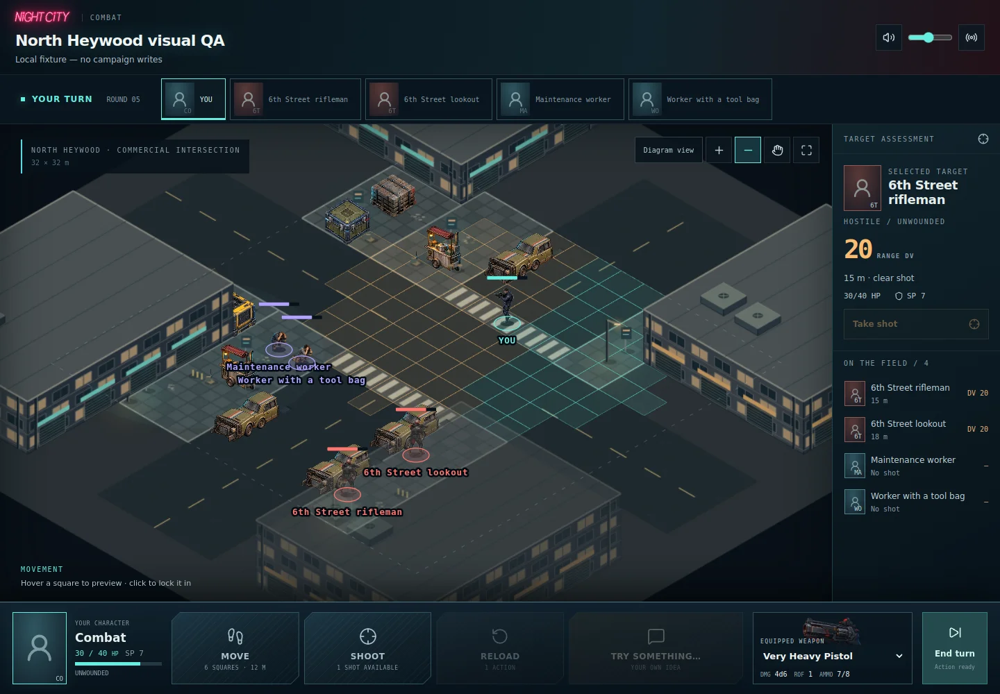
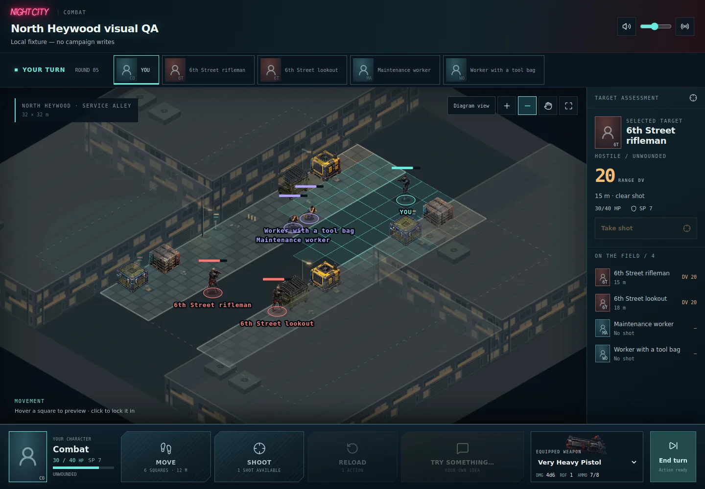

# Composed combat places — Phase 1

The combat grid should feel like a playable slice carved out of a larger real
place. This change adds a bounded, deterministic scene composer and two outdoor
proofs. It does **not** yet generate a battlefield from arbitrary adventure prose.

## Try it

Apply **20261003010000_composed_battlefield_snapshots.sql**, or its Drizzle
counterpart **0008_composed_battlefield_snapshots** (one deployment path, not both).
Then deploy the application.

1. Start a campaign with a test character. Its current weapons, ammo and wounds
   carry into the fixture; this writes real campaign state.
2. Open `/combat`, select that character and **North Heywood · commercial
   intersection · variation 1** or **North Heywood · service alley · variation 1**.
3. Choose **Enter scene · then choose your action**. The persistent scene appears
   in Life. Type **draw my pistol and shoot at the rifleman**, or use the combat
   entry action. Initiative still determines when that request can happen.
4. Finish combat and confirm the return to the adventure and saved aftermath.
5. Use variation 2 or a fresh campaign for another fight. Revisiting the same
   location/anchor deliberately loads its existing state; it does not reset it.

The old Ulysses Street fixture remains available for compatibility. Existing
version-one scenes and fights never acquire new buildings or moved props.
The new layouts are opt-in harness fixtures, not a replacement for every encounter.

## Rendered proof

These are captures of the shipping combat renderer with local fixture data,
not concept art. Tactical commands and persistence are verified separately.

## Architecture

`sceneComposer.ts` composes recipe parcels and structural masses, reserves
crossings and actor slots, then fits coherent clusters to legal zones. Required
story clusters fail explicitly if they cannot fit; optional clusters can be
omitted. No free-cell scatter, model call, or runtime image generation is involved.

- Recipes own spatial organization: a crossing and corner parcels versus an
  enclosed service passage. Their topology is authored; seeds currently vary
  optional service contents and building heights, not entire street networks.
- Cluster definitions own relative arrangements and allowed zone kinds. Parking
  follows the curb axis; a vendor includes stools, supplies, a sign and litter;
  service and loading clusters follow building frontages. Horizontal frontages
  reuse the same clusters with their local axes exchanged.
- Large structures have a frozen footprint and explicit movement/shot blocking.
  They have no HP and do not appear as destructible cover targets. Initially all
  facade doors are closed; no usable interiors or elevated movement are implied.
- Destructible props retain the existing material rules and independent 2 m
  sections. Quarter-turn placement preserves section IDs and HP. Approved
  mirrored isometric sprites follow those section placements; sprites are never
  rotated in screen space.
- Nonblocking dressing is small and visually quiet. Roof equipment sits on
  inaccessible buildings. It does not create unannounced tactical cover.

`sceneEnvironment.ts` validates the resolved world-building data. Snapshot **v2**
contains it inside the arena. It validates references, unique IDs, bounded
geometry, footprints, overlap, saved art vocabulary and actor positions. Its
art bindings reference cover IDs, not duplicate prop coordinates. Existing
snapshot v1 remains supported. The outer scene manifest remains v1 because its
fields and lifecycle are unchanged; the nested battlefield carries the new
version. Loading never reruns a recipe or looks up fresh material HP.

`composedEnvironment.ts` draws ground and architectural masses from that saved
geometry. The existing Phaser renderer still handles actors, damage states,
movement playback and overlays. Shared asset kinds replace the old fixture-ID
art dispatch for composed scenes. Front structures fade around actors and diagram
fallback includes structural footprints. The legacy courtyard/street renderers
remain unchanged.

`shotObstacles` is the shared visibility gate for player capabilities, opening
attack prompts, movement shelter feedback and sight. Hostiles use the existing
movement lattice to route toward a firing lane around static structures, then
apply ordinary destructible-cover behavior. No wall can be destroyed by adding
its ID to the damage map.

## Verification

- 32 seeds of each recipe: placement constraints, connected actor routes,
  deterministic output, JSON save/read equivalence and snapshot size limit.
- Required cruiser/rifleman relationship and vehicle alignment; invalid
  composition fails closed rather than silently changing a saved map.
- Static blocking independent of cover damage; movement-only fence behavior;
  player sight gating and hostile routing around a wall over multiple moves.
- Migration replay from the repository baseline; legacy encounter, battlefield,
  scene receipt, persistent scene, and composed scene SQL regressions. A v1
  client cannot save a v2 battlefield.
- Desktop/mobile browser rendering, diagram switch, zoom, destroyed cover and
  WebGL-loss recovery through the shipping combat board.

## Remaining work

This is a composition proof with procedural architectural art and reused prop
atlases. Facades are intentionally modular but still repetitive; a dedicated
painterly facade/material kit, broader prop facings, and more frontage clusters
are the next visual pass. The reference image remains the density/style target,
not a claim of visual parity.

Before wider rollout: vary parcel topology and cluster candidate anchors, add
interior recipes, accept structured adventure facts and actor relationships,
and playtest cover density and starting ranges. No AI scene interpretation,
automatic city-wide replacement, destructible buildings, multilevel combat,
retreat animation, or civilian population simulation is included here.
