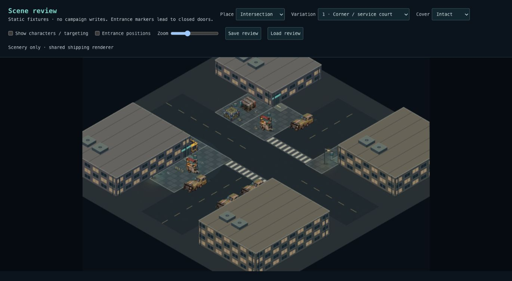
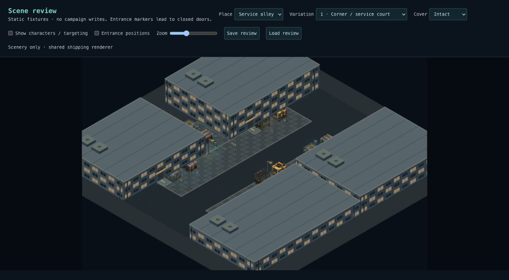
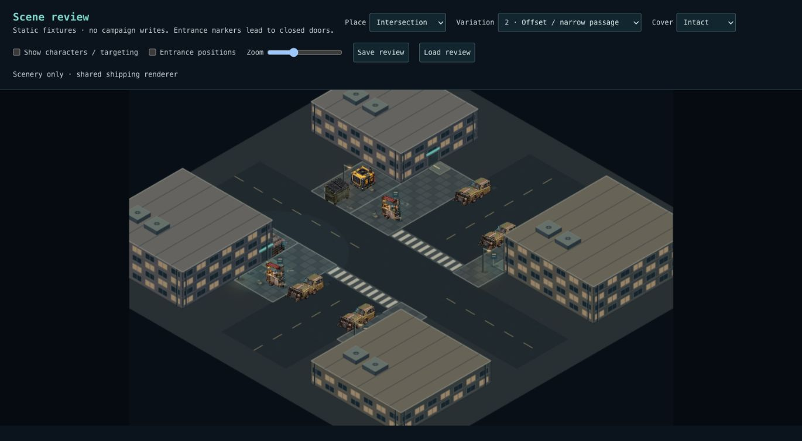
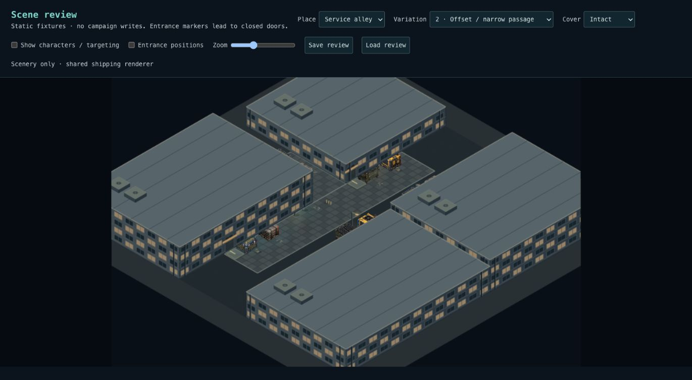
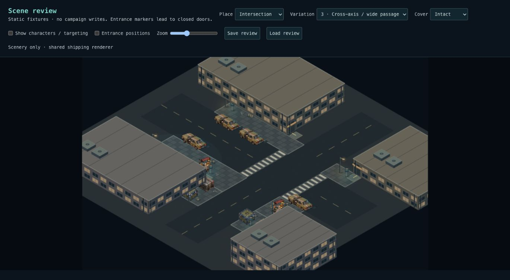
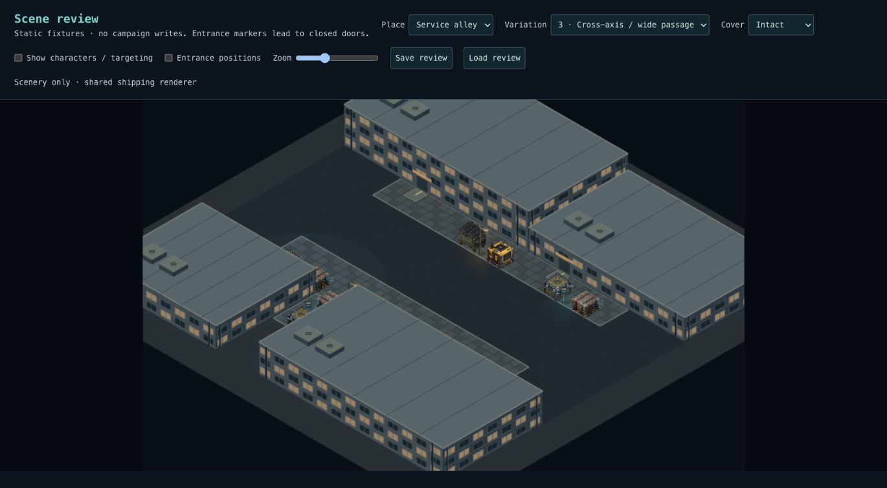
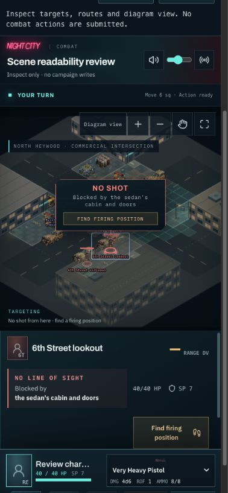

# Composed combat places — Phase 1

The combat grid should feel like a playable slice carved out of a larger real
place. This change adds a bounded, deterministic scene composer and two outdoor
proofs. It does **not** yet generate a battlefield from arbitrary adventure prose.

## Try it

The composed-snapshot SQL was confirmed applied by Levi on October 3, 2026.
This follow-up requires **no additional SQL**. Deploy the application after merging.

Open `/scene-review` first: it needs no login and writes no campaign state.
Review both places and variations 1–3 without characters, then enable characters
for targeting, entrance positions, diagram view, zoom and cover damage. Save
review, refresh, and Load review restores the frozen layout, positions and damage
in this browser. This is a visual review, not a separate combat simulator.

For the deployed campaign smoke test:

1. Start a campaign with a test character. Its current weapons, ammo and wounds
   carry into the fixture; this writes real campaign state.
2. Open `/combat`, select that character and **North Heywood · commercial
   intersection · variation 1** or **North Heywood · service alley · variation 1**.
3. Choose **Enter scene · then choose your action**. The persistent scene appears
   in Life. Type **draw my pistol and shoot at the rifleman**, or use the combat
   entry action. Initiative still determines when that request can happen.
4. Finish combat and confirm the return to the adventure and saved aftermath.
5. Use another variation or a fresh campaign for another fight. Revisiting the same
   location/anchor deliberately loads its existing state; it does not reset it.

The old Ulysses Street fixture remains available for compatibility. Existing
version-one scenes and fights never acquire new buildings or moved props.
The new layouts are opt-in harness fixtures, not a replacement for every encounter.

## Rendered proof

These are captures of the shipping combat renderer with local fixture data,
not concept art. Tactical commands and persistence are verified separately.

| Variation | Intersection                                             | Service alley                                             |
| --------- | -------------------------------------------------------- | --------------------------------------------------------- |
| 1         |           |            |
| 2         |  |           |
| 3         |       |  |

## Architecture

`sceneComposer.ts` composes recipe parcels and structural masses, reserves
crossings, exterior entrances and actor slots, then fits coherent clusters to legal zones. Required
story clusters fail explicitly if they cannot fit; optional clusters can be
omitted. No free-cell scatter, model call, or runtime image generation is involved.

- Recipes own spatial organization: a crossing and corner parcels versus an
  enclosed service passage. Recipe v2 selects three authored
  spatial variants: crossing offsets, passage widths, service-court recesses and
  exchanged axes, plus optional contents and building heights.
- Cluster definitions own relative arrangements and allowed zone kinds. Parking
  follows the curb axis; a vendor includes stools, supplies, a sign and litter;
  service and loading clusters follow building frontages. Horizontal frontages
  reuse the same clusters with their local axes exchanged.
- Large structures have a frozen footprint and explicit movement/shot blocking.
  They have no HP and do not appear as destructible cover targets. Initially all
  facade doors are closed; no usable interiors or elevated movement are implied.
- Destructible props retain the existing material rules and independent 2 m
  sections. Quarter-turn placement preserves section IDs and HP. Approved
  mirrored isometric sprites follow those section placements; sprites are never
  rotated in screen space.
- Nonblocking dressing is small and visually quiet. Roof equipment sits on
  inaccessible buildings. It does not create unannounced tactical cover.

`sceneEnvironment.ts` validates the resolved world-building data. Snapshot **v2**
contains it inside the arena. It validates references, unique IDs, bounded
geometry, footprints, overlap, saved art vocabulary and actor positions. Its
art bindings reference cover IDs, not duplicate prop coordinates. Existing
snapshot v1 remains supported. The outer scene manifest remains v1 because its
fields and lifecycle are unchanged; the nested battlefield carries the new
version. Loading never reruns a recipe or looks up fresh material HP.

`composedEnvironment.ts` draws ground and architectural masses from that saved
geometry. The existing Phaser renderer still handles actors, damage states,
movement playback and overlays. Shared asset kinds replace the old fixture-ID
art dispatch for composed scenes. Front structures fade around actors and diagram
fallback includes structural footprints. The legacy courtyard/street renderers
remain unchanged.

`shotObstacles` is the shared visibility gate for player capabilities, opening
attack prompts, movement shelter feedback and sight. Hostiles use the existing
movement lattice to route toward a firing lane around static structures, then
apply ordinary destructible-cover behavior. No wall can be destroyed by adding
its ID to the damage map.

## Verification

- 32 seeds of each recipe: placement constraints, connected actor routes,
  deterministic output, JSON save/read equivalence and snapshot size limit.
- Required cruiser/rifleman relationship and vehicle alignment; invalid
  composition fails closed rather than silently changing a saved map.
- Static blocking independent of cover damage; movement-only fence behavior;
  player sight gating and hostile routing around a wall over multiple moves.
- Migration replay from the repository baseline; legacy encounter, battlefield,
  scene receipt, persistent scene, and composed scene SQL regressions. A v1
  client cannot save a v2 battlefield.
- Desktop/mobile browser rendering, diagram switch, zoom, destroyed cover and
  WebGL-loss recovery through the shipping combat board.

## Recovery verification — October 3, 2026

Recovered the published `codex/scene-composition-phase1` branch at `7eff747`.
That commit contains the 39-file composition proof described above; the recovered
checkout was clean. The separate local `nightcitytales` checkout had unrelated
README/art changes, which were left untouched. Any changes never pushed from the
stalled Work workspace could not be inspected from this session.

Follow-up fixes:

- Saved v2 layouts now reject props occupying crosswalks or intersections, matching
  the composer's placement constraint instead of accepting an obstructed crossing
  on reload.
- Optional service/loading clusters record the variant actually placed. Existing
  saved geometry remains authoritative and is never regenerated.
- Renamed the Life waiting-line model to `cityTurnModel.ts`: `cityTurns.ts` and
  `CityTurns.tsx` caused case-insensitive Mac resolution to import the model as the
  component, breaking both typecheck and production build.
- The multi-seed regressions explicitly check every actor's route from the player,
  in addition to unoccupied spawns; new regressions cover crossing corruption and
  variant metadata.

Fresh verification: 3,413 tests across 249 files, TypeScript and production build
pass. Code lint has zero errors and 12 existing Fast Refresh warnings. The focused
composition/sight/Life-model suite passes all 28 tests. No SQL changed during this
recovery. SQL replay was not rerun here because PostgreSQL is unavailable; the
SQL checks and rendered captures above are evidence recorded by the prior commit,
not new authenticated end-to-end verification. The migration was subsequently
confirmed applied by Levi; a deployed playthrough is still the rollout gate.

## Completion acceptance — October 3, 2026

| Requirement                                  | Evidence                                                                                                                                                                                                                     |
| -------------------------------------------- | ---------------------------------------------------------------------------------------------------------------------------------------------------------------------------------------------------------------------------- |
| Believable places without characters         | Six browser captures above; `/scene-review` defaults to scenery only. Procedural facades remain an art-polish limit.                                                                                                         |
| Contextual cars, vendors and service objects | 32 seeds per recipe check allowed zones, curb axes, crossing clearance and required actor/prop relationships.                                                                                                                |
| Routes, entrances and art/blocking agreement | Reserved exterior approach tiles are validated for adjacency, occupancy and connectivity. Doors and approach paint read those same saved positions; art bindings read canonical cover.                                       |
| Rotation and destruction                     | Regression tests destroy cabin and engine independently in both axes, preserving their material HP and art anchors. Browser check confirms destroyed cover changes the shot from blocked to clear.                           |
| Readable actors and targeting                | Shared silhouette-aware fading, permanent-wall targeting outline, and diagram fallback. Desktop and 390px mobile review verifies target selection, readout and zoom.                                                         |
| Identical save/reload                        | All six layouts and alternate entrance poses round-trip geometry, positions and damage through production readers. Browser Save → refresh → Load verified. A historical recipe-v1 snapshot from `7eff747` remains unchanged. |
| No per-location renderer branch              | Composition renders from saved environment data; a regression changes the arena key and still selects the shared renderer.                                                                                                   |

Fresh suite: **3,426 tests across 251 files**, TypeScript and production build pass;
code lint has zero errors and 12 existing Fast Refresh warnings. The browser
review uses local static data, not an authenticated database round trip. CI's SQL
replay remains the database regression gate. The final deployed smoke test is:
enter a composed scene with a test campaign, move and damage cover, refresh and
compare positions/damage, finish combat, then verify its durable aftermath.

The Phase 1 implementation and local acceptance proof are complete. Deployment
acceptance remains open until that campaign smoke test passes. This does not
claim final artwork parity, automatic prose interpretation, or city-wide rollout.

## Remaining work

This is a composition proof with procedural architectural art and reused prop
atlases. Facades are intentionally modular but still repetitive; a dedicated
painterly facade/material kit, broader prop facings, and more frontage clusters
are the next visual pass. The reference image remains the density/style target,
not a claim of visual parity.

After this bounded proof: expand candidate anchors, add interior recipes,
accept structured adventure facts and actor relationships,
and playtest cover density and starting ranges. No AI scene interpretation,
automatic city-wide replacement, destructible buildings, multilevel combat,
retreat animation, or civilian population simulation is included here.
