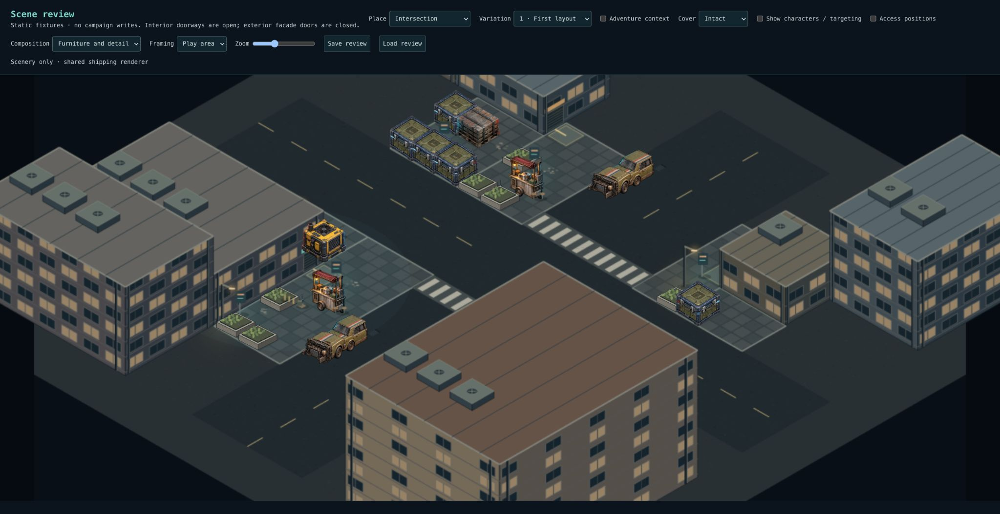
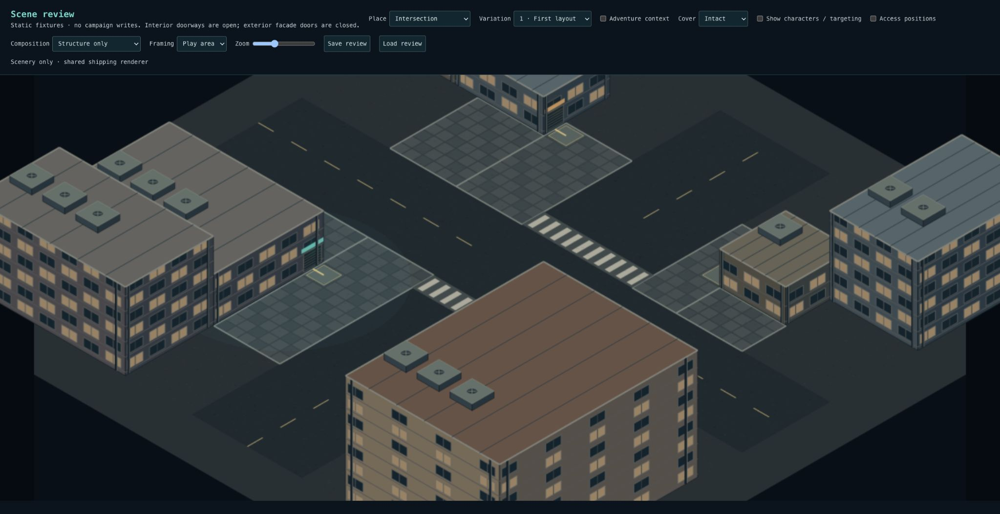
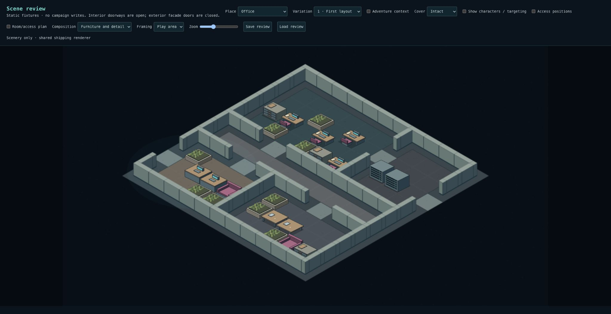
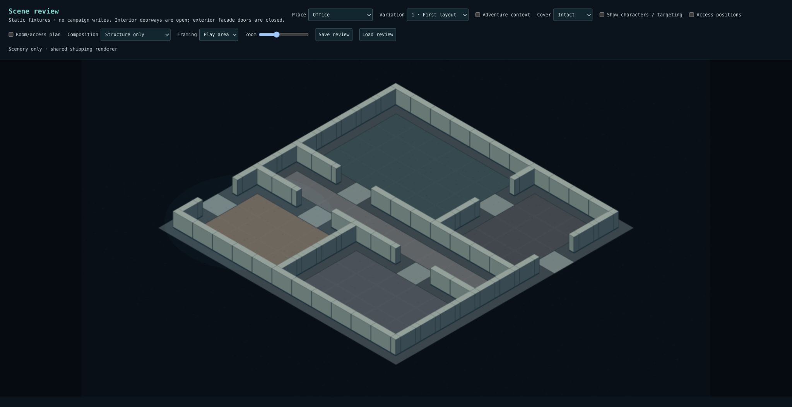
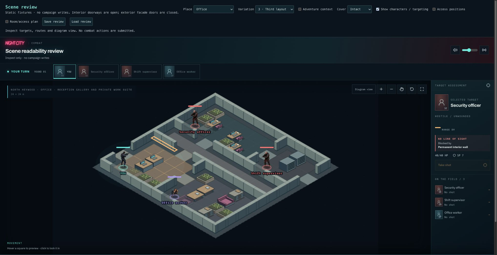

# Spatial organization checkpoint

First of four PRs toward believable, densely occupied places:

1. **Scale and spatial organization (this PR):** intersection corner identities,
   compact office programs, closer framing and a structure-only review.
2. **Complete activity areas:** coordinated storefront/service groups, work pods,
   reception and meeting arrangements, with reserved circulation.
3. **Boundaries and attachments:** fences, awnings, recesses and wall/counter
   details concentrated around structural edges.
4. **Transfer and variation:** carry the proven approach to alley, nightclub,
   warehouse, auto garage and residential street; compare seeds and tactical behavior.

## What changed

Intersections now compose attached shops, a taller residential frontage, a low
workshop return around a loading court, and a lower utility frontage beside a
neighboring block. These are distinct footprints/heights, not four copies of the
same building group. Existing shared structures, zones and collision handle them.

Offices use 24×24m shells instead of 32×32m. Three plans organize reception and
meeting spaces before staff workspace; support rooms connect through workspace
and have a separate exterior exit. Grid spacing remains 2m. Furniture continues
through the existing cluster solver; detailed activity arrangements are PR 2.

The shared scenic camera starts closer, with an explicit Overview control.
Characters, hit-region height and structure height follow projected metre scale.
Scene review adds Structure only (hides furniture and dressing) and Play area /
Overview framing. Inspection does not mutate the saved layout or collision.

## Review

Open `/scene-review`. Compare Intersection and Office, variations 1–3:

- Hide characters, switch Composition to Structure only. Judge the building
  silhouette, room proportions and circulation before looking at furnishings.
- Restore Furniture and detail. Routes and door approaches must remain clear.
- Enable characters; check targeting, diagram alignment, Reset camera and Overview.
- Save/load a review to check the frozen layout. Existing campaign scenes retain
  their saved geometry; new composition appears in newly generated scenes.

## Evidence and limits

Full suite: 3,486 tests passed, followed by 14 focused tests including two new
structural-program checks. Typecheck and production build passed. Lint has zero
errors and 12 existing warnings. Visually inspected all three office variants,
intersection furnishing/structure views, and office targeting at desktop and
mobile widths. Camera registration tests cover desktop and small-screen sizes.

This is a structural checkpoint, not the full reference-quality milestone.
The street still needs convincing frontage activity and attached detail. Office
furniture repeats too many planters and separate tables; rooms do not yet read as
complete activity groups. Architecture is still deliberately low-detail. PRs 2–3
address those shortcomings before extending the treatment to every archetype.
Elevated structures remain decorative. No new SQL migration is needed; existing
immutable snapshots and lifecycle contracts remain unchanged.
